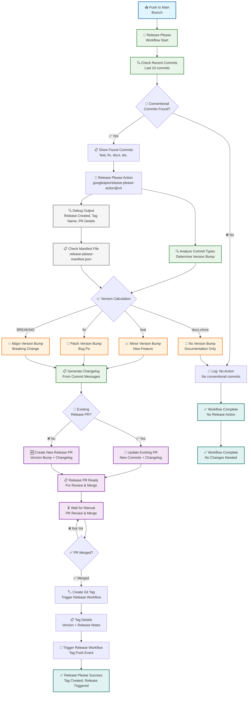
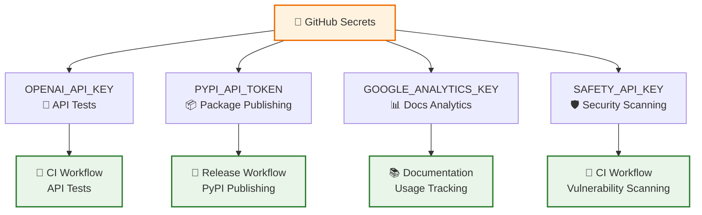
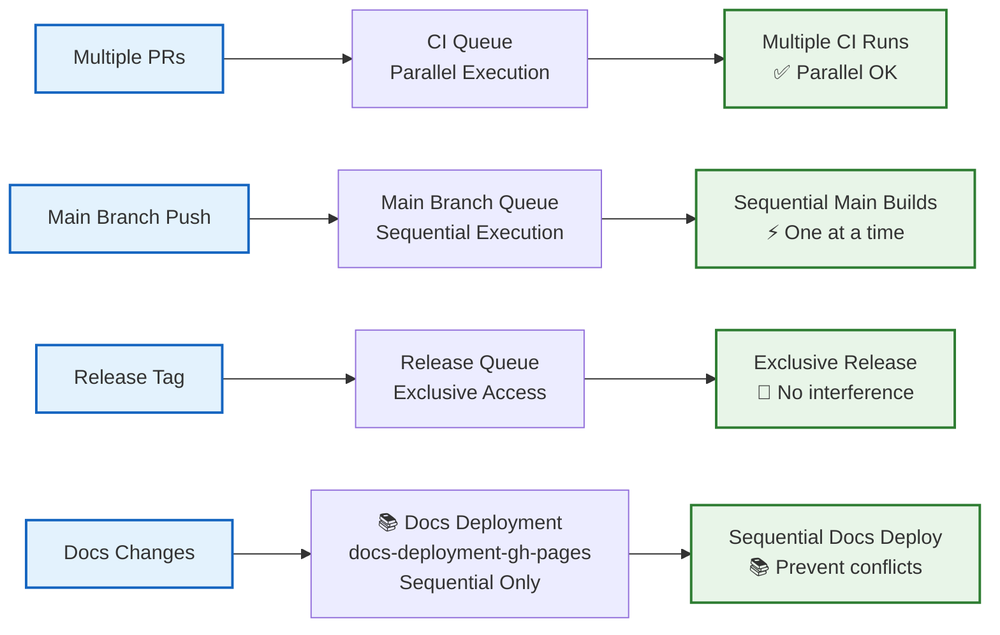

# GitHub Workflows Architecture

Detailed documentation of all GitHub Actions workflows and their interactions.

## Workflow Overview

The project uses a sophisticated CI/CD pipeline with five interconnected workflows that handle testing, security, releases, and documentation deployment.

## Complete Workflow Interaction Diagram

```mermaid
flowchart TD
    %% External Triggers
    Developer[👨‍💻 Developer] --> CodeChanges[📝 Code Changes]
    CodeChanges --> FeatureBranch[🌿 Feature Branch]
    FeatureBranch --> PullRequest[🔄 Pull Request to Main]

    %% PR Workflows
    PullRequest --> CI_PR[🚀 CI Workflow<br/>Pull Request Trigger]
    PullRequest --> DepReview[🔍 Dependency Review<br/>Security Analysis]

    %% CI PR Jobs
    CI_PR --> TestJob[🧪 Test Job<br/>Matrix: Python 3.11, 3.12]
    CI_PR --> SecurityJob[🛡️ Security Job<br/>Safety + Bandit]

    TestJob --> UnitTests[⚡ Unit Tests<br/>Fast execution]
    TestJob --> IntegrationTests[🔗 Integration Tests<br/>Component interaction]
    SecurityJob --> VulnerabilityCheck[🚨 Vulnerability Scan]
    SecurityJob --> CodeAnalysis[📊 Static Code Analysis]

    %% Dependency Review
    DepReview --> LicenseCheck[📄 License Compliance]
    DepReview --> SecurityAdvisory[🛡️ Security Advisory Check]

    %% PR Resolution
    UnitTests --> PRApproval{📋 PR Approval}
    IntegrationTests --> PRApproval
    VulnerabilityCheck --> PRApproval
    CodeAnalysis --> PRApproval
    LicenseCheck --> PRApproval
    SecurityAdvisory --> PRApproval

    PRApproval -->|✅ Approved| MergeToMain[🎯 Merge to Main]
    PRApproval -->|❌ Changes Needed| CodeChanges

    %% Main Branch Workflows
    MergeToMain --> CI_Main[🚀 CI Workflow<br/>Main Branch Trigger]
    MergeToMain --> ReleasePleaseWorkflow[🎁 Release Please<br/>Conventional Commit Analysis]
    MergeToMain --> DocsCheck{📚 Documentation<br/>Changes?}

    %% CI Main Branch
    CI_Main --> MainTestJob[🧪 Full Test Suite<br/>All Tests]
    CI_Main --> APITestJob[🌐 API Test Job<br/>OpenAI Integration]
    CI_Main --> MainSecurityJob[🛡️ Security Validation]

    MainTestJob --> TestResults{✅ All Tests Pass?}
    APITestJob --> TestResults
    MainSecurityJob --> TestResults

    TestResults -->|❌ Failed| NotifyFailure[📧 Failure Notification<br/>GitHub Checks Failed]
    TestResults -->|✅ Passed| CISuccess[✅ CI Success<br/>Main Branch Validated]

    %% Release Please Logic
    ReleasePleaseWorkflow --> ConventionalCommitCheck{📝 Conventional<br/>Commits Found?}
    ConventionalCommitCheck -->|❌ No| NoReleaseAction[❌ No Release Action<br/>Wait for Next Push]
    ConventionalCommitCheck -->|✅ Yes| AnalyzeCommits[🔍 Analyze Commit Types<br/>feat, fix, docs, etc.]

    AnalyzeCommits --> VersionBump[📈 Calculate Version Bump<br/>Major/Minor/Patch]
    VersionBump --> GenerateChangelog[📋 Generate Changelog<br/>From Commit Messages]
    GenerateChangelog --> CreateReleasePR[🔄 Create Release PR<br/>Version + Changelog]

    CreateReleasePR --> ReleasePRReview{👀 Release PR<br/>Review & Merge}
    ReleasePRReview -->|⏳ Pending| WaitForApproval[⏳ Wait for Manual<br/>PR Approval]
    ReleasePRReview -->|✅ Merged| CreateGitTag[🏷️ Create Git Tag<br/>Trigger Release]

    %% Release Workflow
    CreateGitTag --> ReleaseWorkflow[🚢 Release Workflow<br/>Tag Push Trigger]
    ReleaseWorkflow --> ReleaseDetermine[🎯 Determine Release Type<br/>Tag vs Manual]

    ReleaseDetermine --> ReleaseBuild[🏗️ Build Package<br/>uv build]
    ReleaseDetermine --> ReleaseTest[🧪 Release Tests<br/>Final Validation]

    ReleaseBuild --> PackageVerify[✅ Package Verification<br/>twine check]
    ReleaseTest --> PackageVerify

    PackageVerify --> PublishCondition{🎯 Publish Ready?}
    PublishCondition -->|❌ Failed| ReleaseFailed[❌ Release Failed<br/>Error Notification]
    PublishCondition -->|✅ Success| PyPIPublish[📦 Publish to PyPI<br/>Package Distribution]

    PyPIPublish --> GitHubRelease[📋 Create GitHub Release<br/>Release Notes + Assets]
    GitHubRelease --> TriggerVersionedDocs[📚 Trigger Versioned Docs<br/>Repository Dispatch]
    TriggerVersionedDocs --> ReleaseComplete[✅ Release Complete<br/>All Artifacts Published]

    %% Documentation Workflows
    DocsCheck -->|✅ Yes| DocsVersionedWorkflow[📚 Docs Versioned Workflow<br/>Documentation Changes]
    DocsCheck -->|❌ No| CISuccess

    DocsVersionedWorkflow --> DetermineDocsType[🎯 Determine Deployment Type<br/>Latest vs Versioned]

    DetermineDocsType -->|📄 Latest| DeployLatest[🌐 Deploy Latest Docs<br/>GitHub Pages Root]
    DetermineDocsType -->|🏷️ Versioned| DeployVersioned[📋 Deploy Versioned Docs<br/>Version-specific Path]

    DeployLatest --> MikeDeploy1[⚙️ Mike Deploy Latest<br/>Preserve Existing Versions]
    DeployVersioned --> MikeDeploy2[⚙️ Mike Deploy Version<br/>Add New Version]

    MikeDeploy1 --> UpdateVersionSelector1[🔄 Update Version Selector<br/>Latest as Default]
    MikeDeploy2 --> UpdateVersionSelector2[🔄 Update Version Selector<br/>Add New Version]

    UpdateVersionSelector1 --> DocsSuccess[✅ Documentation Deployed<br/>GitHub Pages Updated]
    UpdateVersionSelector2 --> DocsSuccess

    %% Repository Dispatch from Release
    TriggerVersionedDocs --> DispatchEvent[📡 Repository Dispatch<br/>release-triggered Event]
    DispatchEvent --> DocsVersionedWorkflow

    %% Styling
    classDef devStyle fill:#e3f2fd,stroke:#1565c0,stroke-width:2px
    classDef ciStyle fill:#e8f5e8,stroke:#2e7d32,stroke-width:2px
    classDef releaseStyle fill:#fff3e0,stroke:#ef6c00,stroke-width:2px
    classDef docsStyle fill:#f3e5f5,stroke:#7b1fa2,stroke-width:2px
    classDef errorStyle fill:#ffebee,stroke:#c62828,stroke-width:2px
    classDef successStyle fill:#e0f2f1,stroke:#00695c,stroke-width:2px
    classDef decisionStyle fill:#fafafa,stroke:#424242,stroke-width:2px

    class Developer,CodeChanges,FeatureBranch devStyle
    class CI_PR,CI_Main,TestJob,SecurityJob,MainTestJob,APITestJob,MainSecurityJob ciStyle
    class ReleasePleaseWorkflow,ReleaseWorkflow,ReleaseBuild,PyPIPublish,GitHubRelease releaseStyle
    class DocsVersionedWorkflow,DeployLatest,DeployVersioned,MikeDeploy1,MikeDeploy2 docsStyle
    class ReleaseFailed,NotifyFailure errorStyle
    class CISuccess,ReleaseComplete,DocsSuccess successStyle
    class PRApproval,TestResults,ConventionalCommitCheck,ReleasePRReview,PublishCondition,DocsCheck,DetermineDocsType decisionStyle
```



## Individual Workflow Details

### 1. CI Workflow (`ci.yml`)

```mermaid
flowchart TD
    %% Triggers
    PRTrigger[📥 Pull Request<br/>to main/develop] --> CIStart[🚀 CI Workflow Start]
    PushTrigger[📥 Push to<br/>main branch] --> CIStart
    ManualTrigger[📥 Manual<br/>Workflow Dispatch] --> CIStart

    %% Job Matrix Setup
    CIStart --> SetupMatrix[⚙️ Setup Test Matrix<br/>Python 3.11 & 3.12<br/>Ubuntu Latest]

    %% Test Job
    SetupMatrix --> TestJob[🧪 Test Job<br/>Matrix Strategy]
    TestJob --> InstallUV[📦 Install UV<br/>Package Manager]
    InstallUV --> SyncDeps[🔄 Sync Dependencies<br/>uv sync]
    SyncDeps --> LintFormat[🧹 Lint & Format<br/>ruff check & format]
    LintFormat --> RunTests[⚡ Run Tests<br/>pytest with markers]

    RunTests --> UnitTests[🔬 Unit Tests<br/>@pytest.mark.unit]
    RunTests --> IntegrationTests[🔗 Integration Tests<br/>@pytest.mark.integration]
    RunTests --> EdgeCaseTests[⚠️ Edge Case Tests<br/>@pytest.mark.edge_case]

    UnitTests --> TestResults{✅ Test Results}
    IntegrationTests --> TestResults
    EdgeCaseTests --> TestResults

    %% API Tests (Conditional)
    TestResults -->|✅ Passed| APICheck{🌐 API Tests<br/>Required?}
    TestResults -->|❌ Failed| TestFailed[❌ CI Failed<br/>Test Failures]

    APICheck -->|Main Branch or [api-test]| APITestJob[🌐 API Test Job<br/>OpenAI Integration]
    APICheck -->|Other Branches| SkipAPI[⏭️ Skip API Tests<br/>Branch Protection]

    APITestJob --> APIKeyCheck[🔑 API Key Validation<br/>Test Environment Detection]
    APIKeyCheck --> RunAPITests[🤖 Run API Tests<br/>@pytest.mark.api]
    RunAPITests --> APIResults{✅ API Results}

    APIResults -->|✅ Passed| SecurityJob[🛡️ Security Job]
    APIResults -->|❌ Failed| APIFailed[❌ API Tests Failed<br/>Integration Issues]
    SkipAPI --> SecurityJob

    %% Security Job
    SecurityJob --> InstallSecTools[🛡️ Install Security Tools<br/>safety, bandit]
    InstallSecTools --> VulnScan[🚨 Vulnerability Scan<br/>safety scan]
    VulnScan --> StaticAnalysis[📊 Static Analysis<br/>bandit -r src/]

    StaticAnalysis --> SecurityResults{🛡️ Security Results}
    SecurityResults -->|✅ Passed| CISuccess[✅ CI Success<br/>All Checks Passed]
    SecurityResults -->|❌ Failed| SecurityFailed[❌ Security Failed<br/>Vulnerabilities Found]

    %% Final States
    TestFailed --> CIFailed[❌ CI Pipeline Failed]
    APIFailed --> CIFailed
    SecurityFailed --> CIFailed
    CISuccess --> NextWorkflow[➡️ Trigger Next Workflow<br/>If Main Branch]

    %% Styling
    classDef triggerStyle fill:#e1f5fe,stroke:#01579b,stroke-width:2px
    classDef jobStyle fill:#e8f5e8,stroke:#2e7d32,stroke-width:2px
    classDef testStyle fill:#f3e5f5,stroke:#7b1fa2,stroke-width:2px
    classDef securityStyle fill:#fff8e1,stroke:#f57f17,stroke-width:2px
    classDef successStyle fill:#e0f2f1,stroke:#00695c,stroke-width:2px
    classDef errorStyle fill:#ffebee,stroke:#c62828,stroke-width:2px

    class PRTrigger,PushTrigger,ManualTrigger triggerStyle
    class TestJob,APITestJob,SecurityJob jobStyle
    class UnitTests,IntegrationTests,EdgeCaseTests,RunAPITests testStyle
    class VulnScan,StaticAnalysis,APIKeyCheck securityStyle
    class CISuccess,NextWorkflow successStyle
    class TestFailed,APIFailed,SecurityFailed,CIFailed errorStyle
```

### 2. Release Please Workflow (`release-please.yml`)



### 3. Release Workflow (`release.yml`)

```mermaid
flowchart TD
    %% Triggers
    TagPush[📥 Git Tag Push<br/>v*.*.* pattern] --> ReleaseStart[🚢 Release Workflow<br/>Start]
    ManualDispatch[📥 Manual Dispatch<br/>version input] --> ReleaseStart

    %% Release Please Integration
    ReleasePleaseTag[🏷️ Tag from<br/>Release Please] --> TagPush

    %% Job Setup
    ReleaseStart --> DetermineType[🎯 Determine Release Type<br/>Tag Push vs Manual]
    DetermineType --> DebugContext[🔍 Debug Workflow Context<br/>Event, Ref, Secrets Check]

    DebugContext --> ReleaseJob[🚢 Release Job<br/>Ubuntu Latest]

    %% Build Process
    ReleaseJob --> CheckoutCode[📥 Checkout Repository<br/>Full History]
    CheckoutCode --> InstallUV[📦 Install UV Package Manager<br/>Latest Version]
    InstallUV --> SetupPython[🐍 Setup Python 3.12<br/>uv python install]
    SetupPython --> SyncDeps[🔄 Install Dependencies<br/>uv sync]

    %% Testing Phase
    SyncDeps --> RunTests[🧪 Run Full Test Suite<br/>All Test Markers]
    RunTests --> TestResults{✅ Tests Pass?}

    TestResults -->|❌ Failed| TestsFailed[❌ Release Failed<br/>Tests Not Passing]
    TestResults -->|✅ Passed| BuildPackage[🏗️ Build Python Package<br/>uv build]

    %% Package Verification
    BuildPackage --> InstallTwine[📦 Install Twine<br/>Package Verification]
    InstallTwine --> VerifyPackage[✅ Verify Package<br/>twine check dist/*]

    VerifyPackage --> VerificationResult{✅ Package Valid?}
    VerificationResult -->|❌ Failed| PackageFailed[❌ Release Failed<br/>Package Verification Error]
    VerificationResult -->|✅ Passed| CheckSecrets[🔑 Check PyPI Secrets<br/>PYPI_API_TOKEN exists]

    %% Publishing Phase
    CheckSecrets --> SecretCheck{🔐 Secrets Available?}
    SecretCheck -->|❌ Missing| SecretsMissing[❌ Release Failed<br/>Missing PyPI Token]
    SecretCheck -->|✅ Available| PublishPyPI[📦 Publish to PyPI<br/>twine upload]

    PublishPyPI --> PublishResult{📦 Publish Success?}
    PublishResult -->|❌ Failed| PublishFailed[❌ PyPI Publish Failed<br/>Upload Error]
    PublishResult -->|✅ Success| CreateRelease[📋 Create GitHub Release<br/>Tag + Release Notes]

    %% GitHub Release Creation
    CreateRelease --> AttachAssets[📎 Attach Build Artifacts<br/>dist/* files]
    AttachAssets --> ReleaseResult{📋 Release Created?}

    ReleaseResult -->|❌ Failed| ReleaseFailed[❌ GitHub Release Failed<br/>API Error]
    ReleaseResult -->|✅ Success| TriggerDocs[📚 Trigger Documentation<br/>Repository Dispatch]

    %% Documentation Trigger
    TriggerDocs --> DocsDispatch[📡 Send Repository Dispatch<br/>release-triggered Event]
    DocsDispatch --> DocsResult{📡 Dispatch Success?}

    DocsResult -->|❌ Failed| DocsDispatchFailed[⚠️ Docs Dispatch Failed<br/>Manual Trigger Needed]
    DocsResult -->|✅ Success| ReleaseSuccess[✅ Release Complete<br/>All Systems Updated]

    %% Error Handling
    TestsFailed --> NotifyFailure[📧 Notify Failure<br/>GitHub Status Check]
    PackageFailed --> NotifyFailure
    SecretsMissing --> NotifyFailure
    PublishFailed --> NotifyFailure
    ReleaseFailed --> NotifyFailure
    DocsDispatchFailed --> PartialSuccess[⚠️ Partial Success<br/>Package Released, Docs Manual]

    %% Final States
    NotifyFailure --> WorkflowFailed[❌ Release Workflow Failed]
    PartialSuccess --> WorkflowPartial[⚠️ Release Partially Complete]
    ReleaseSuccess --> WorkflowSuccess[✅ Release Workflow Success]

    %% Styling
    classDef triggerStyle fill:#e1f5fe,stroke:#01579b,stroke-width:2px
    classDef processStyle fill:#e8f5e8,stroke:#2e7d32,stroke-width:2px
    classDef testStyle fill:#f3e5f5,stroke:#7b1fa2,stroke-width:2px
    classDef buildStyle fill:#fff8e1,stroke:#f57f17,stroke-width:2px
    classDef publishStyle fill:#fff3e0,stroke:#ef6c00,stroke-width:2px
    classDef successStyle fill:#e0f2f1,stroke:#00695c,stroke-width:2px
    classDef errorStyle fill:#ffebee,stroke:#c62828,stroke-width:2px
    classDef warningStyle fill:#fffde7,stroke:#f9a825,stroke-width:2px

    class TagPush,ManualDispatch,ReleasePleaseTag triggerStyle
    class ReleaseStart,DetermineType,DebugContext,ReleaseJob processStyle
    class RunTests,TestResults testStyle
    class BuildPackage,InstallTwine,VerifyPackage buildStyle
    class PublishPyPI,CreateRelease,AttachAssets publishStyle
    class ReleaseSuccess,WorkflowSuccess successStyle
    class TestsFailed,PackageFailed,PublishFailed,ReleaseFailed,WorkflowFailed errorStyle
    class PartialSuccess,WorkflowPartial,DocsDispatchFailed warningStyle
```



### 4. Documentation Versioned Workflow (`docs-versioned.yml`)

#### Enhanced Trigger Logic & Safety Checks

The docs-versioned workflow has been significantly improved with robust trigger logic and comprehensive safety checks:

**Key Improvements:**

- **Enhanced Trigger Logic**: Proper handling of all event types (push, release, repository_dispatch, workflow_dispatch)
- **Version Validation**: Validates semantic version format before deployment
- **Conflict Resolution**: Retry logic with exponential backoff for concurrent deployments
- **Safety Checks**: Prevents no-op deployments with explicit verification
- **Comprehensive Logging**: Debug output for troubleshooting deployment issues

```mermaid
flowchart TD
    %% Triggers with Enhanced Logic
    PushMain[📥 Push to Main<br/>docs/** changes] --> DocsStart[📚 Docs Versioned<br/>Workflow Start]
    ReleaseCreated[📥 Release Created<br/>published event] --> DocsStart
    RepoDispatch[📥 Repository Dispatch<br/>release-triggered] --> DocsStart
    ManualDispatch[📥 Manual Dispatch<br/>version input] --> DocsStart

    %% Enhanced Deployment Type Determination
    DocsStart --> ConcurrencyCheck[🔄 Concurrency Control<br/>docs-deployment-gh-pages]
    ConcurrencyCheck --> DetermineType[🎯 Enhanced Deployment Logic<br/>Comprehensive Event Analysis]

    %% Improved Decision Logic
    DetermineType --> TriggerAnalysis{🔍 Trigger Analysis}
    TriggerAnalysis -->|Push to Main| DeployLatest[📄 Deploy Latest<br/>Documentation Changes]
    TriggerAnalysis -->|Release Event| ExtractReleaseVersion[📋 Extract Release Version<br/>From release.tag_name]
    TriggerAnalysis -->|Repository Dispatch| ExtractDispatchVersion[📋 Extract Dispatch Version<br/>From client_payload.tag]
    TriggerAnalysis -->|Manual Latest| DeployLatest
    TriggerAnalysis -->|Manual Version| ExtractManualVersion[📋 Extract Manual Version<br/>From inputs.version]

    %% Version Processing
    ExtractReleaseVersion --> ValidateVersion[✅ Validate Version Format<br/>Semantic Versioning Check]
    ExtractDispatchVersion --> ValidateVersion
    ExtractManualVersion --> ValidateVersion

    ValidateVersion --> VersionCheck{📋 Version Valid?}
    VersionCheck -->|❌ Invalid| ValidationFailed[❌ Version Validation Failed<br/>Invalid Format]
    VersionCheck -->|✅ Valid| DeployVersioned[🏷️ Deploy Versioned Docs<br/>New Version Release]

    %% Safety Check Job
    DetermineType --> SafetyCheck[🛡️ Safety Check Job<br/>Prevent No-Op Deployments]
    SafetyCheck --> ShouldDeploy{🤔 Should Deploy?}
    ShouldDeploy -->|❌ No| WarnNoDeployment[⚠️ Warn No Deployment<br/>Event Type Not Handled]
    ShouldDeploy -->|✅ Yes| ProceedDeployment[✅ Proceed with Deployment<br/>Event Matches Trigger Logic]

    %% Latest Documentation Deployment
    DeployLatest --> LatestSetup[⚙️ Setup Latest Environment<br/>UV + Python 3.12]
    LatestSetup --> LatestSync[🔄 Sync Dependencies<br/>uv sync]
    LatestSync --> LatestGitConfig[⚙️ Configure Git<br/>GitHub Action credentials]

    LatestGitConfig --> FetchGHPages1[📡 Fetch gh-pages Branch<br/>Conflict Prevention]
    FetchGHPages1 --> MikeLatestLocal[📚 Mike Deploy Latest Local<br/>update-aliases + set-default]

    %% Enhanced Retry Logic for Latest
    MikeLatestLocal --> LatestRetryLoop[🔄 Enhanced Retry Loop<br/>Max 3 Attempts, Exponential Backoff]
    LatestRetryLoop --> LatestPushAttempt[📤 Latest Push Attempt<br/>git push origin gh-pages]
    LatestPushAttempt --> LatestPushResult{📤 Push Success?}

    LatestPushResult -->|✅ Success| LatestComplete[✅ Latest Docs Deployed<br/>Default Version Updated]
    LatestPushResult -->|❌ Failed| LatestConflictResolve[🔄 Resolve Latest Conflicts<br/>Rebase + Re-deploy]
    LatestConflictResolve --> MikeLatestLocal

    %% Versioned Documentation Deployment
    DeployVersioned --> VersionedSetup[⚙️ Setup Versioned Environment<br/>UV + Python 3.12]
    VersionedSetup --> VersionedSync[🔄 Sync Dependencies<br/>uv sync]
    VersionedSync --> VersionedGitConfig[⚙️ Configure Git<br/>GitHub Action credentials]

    VersionedGitConfig --> FetchGHPages2[📡 Fetch gh-pages Branch<br/>Conflict Prevention]
    FetchGHPages2 --> MikeVersionedLocal[📚 Mike Deploy Version Local<br/>update-aliases for vX.Y.Z]

    %% Enhanced Retry Logic for Versioned
    MikeVersionedLocal --> VersionedRetryLoop[🔄 Enhanced Retry Loop<br/>Max 3 Attempts, Exponential Backoff]
    VersionedRetryLoop --> VersionedPushAttempt[📤 Versioned Push Attempt<br/>git push origin gh-pages]
    VersionedPushAttempt --> VersionedPushResult{📤 Push Success?}

    VersionedPushResult -->|✅ Success| VersionedComplete[✅ Versioned Docs Deployed<br/>New Version Available]
    VersionedPushResult -->|❌ Failed| VersionedConflictResolve[🔄 Resolve Version Conflicts<br/>Rebase + Re-deploy]
    VersionedConflictResolve --> MikeVersionedLocal

    %% Comprehensive Error Handling
    LatestSetup --> LatestError{❌ Setup Error?}
    VersionedSetup --> VersionedError{❌ Setup Error?}

    LatestError -->|✅ Success| LatestSync
    LatestError -->|❌ Failed| LatestFailed[❌ Latest Deploy Failed<br/>Environment Setup Error]

    VersionedError -->|✅ Success| VersionedSync
    VersionedError -->|❌ Failed| VersionedFailed[❌ Versioned Deploy Failed<br/>Environment Setup Error]

    %% Final Success States
    LatestComplete --> LogLatestSuccess[📝 Log Latest Success<br/>GitHub Pages Updated]
    VersionedComplete --> LogVersionedSuccess[📝 Log Versioned Success<br/>Version URL Available]

    LogLatestSuccess --> DocsSuccess[✅ Documentation Workflow Complete<br/>All Systems Updated]
    LogVersionedSuccess --> DocsSuccess

    %% Final Error States
    ValidationFailed --> DocsFailed[❌ Documentation Workflow Failed]
    WarnNoDeployment --> DocsSkipped[⏭️ Documentation Workflow Skipped]
    LatestFailed --> DocsFailed
    VersionedFailed --> DocsFailed

    %% Integration Points
    DocsSuccess --> UpdateGitHubPages[🌐 GitHub Pages Updated<br/>Documentation Live]
    UpdateGitHubPages --> VersionSelectorUpdate[🔄 Version Selector Updated<br/>Mike Built-in Functionality]

    %% Styling
    classDef triggerStyle fill:#e1f5fe,stroke:#01579b,stroke-width:2px
    classDef processStyle fill:#e8f5e8,stroke:#2e7d32,stroke-width:2px
    classDef deployStyle fill:#f3e5f5,stroke:#7b1fa2,stroke-width:2px
    classDef mikeStyle fill:#fff8e1,stroke:#f57f17,stroke-width:2px
    classDef validationStyle fill:#e8eaf6,stroke:#3f51b5,stroke-width:2px
    classDef retryStyle fill:#fff3e0,stroke:#ff9800,stroke-width:2px
    classDef successStyle fill:#e0f2f1,stroke:#00695c,stroke-width:2px
    classDef errorStyle fill:#ffebee,stroke:#c62828,stroke-width:2px
    classDef warningStyle fill:#fffde7,stroke:#f9a825,stroke-width:2px
    classDef skipStyle fill:#f5f5f5,stroke:#757575,stroke-width:2px

    class PushMain,ReleaseCreated,RepoDispatch,ManualDispatch triggerStyle
    class DocsStart,ConcurrencyCheck,DetermineType,TriggerAnalysis,SafetyCheck processStyle
    class DeployLatest,DeployVersioned,LatestSetup,VersionedSetup deployStyle
    class MikeLatestLocal,MikeVersionedLocal mikeStyle
    class ValidateVersion,VersionCheck,ExtractReleaseVersion,ExtractDispatchVersion,ExtractManualVersion validationStyle
    class LatestRetryLoop,VersionedRetryLoop,LatestConflictResolve,VersionedConflictResolve retryStyle
    class DocsSuccess,LatestComplete,VersionedComplete,UpdateGitHubPages,VersionSelectorUpdate successStyle
    class ValidationFailed,LatestFailed,VersionedFailed,DocsFailed errorStyle
    class WarnNoDeployment warningStyle
    class DocsSkipped skipStyle
```



#### Key Workflow Features

**Enhanced Trigger Logic:**

- **Push to Main**: Automatically deploys `latest` documentation for docs changes
- **Release Events**: Extracts version from `release.tag_name` and deploys versioned docs
- **Repository Dispatch**: Handles `release-triggered` events from release workflow
- **Manual Dispatch**: Supports both "latest" and specific version deployments

**Version Validation:**

- Validates semantic versioning format (X.Y.Z or X.Y.Z-suffix)
- Prevents deployment of invalid version formats
- Comprehensive error reporting for validation failures

**Conflict Resolution:**

- Robust retry logic with exponential backoff (3 attempts)
- Automatic conflict resolution via rebase/reset
- Prevents concurrent deployment conflicts with exclusive concurrency group

**Safety & Monitoring:**

- Explicit no-deployment warnings for unhandled events
- Comprehensive debug logging throughout the process
- Clear success/failure reporting with actionable URLs

### 5. Dependency Review Workflow (`dependency-review.yml`)

```mermaid
flowchart TD
    %% Trigger
    PRCreated[📥 Pull Request<br/>to main/develop] --> DepStart[🔍 Dependency Review<br/>Workflow Start]

    %% Setup
    DepStart --> CheckoutPR[📥 Checkout PR<br/>Compare Changes]
    CheckoutPR --> DepReviewAction[🔍 Dependency Review Action<br/>github/dependency-review-action]

    %% Configuration Loading
    DepReviewAction --> LoadConfig[⚙️ Load Configuration<br/>dependency-review-config.yml]
    LoadConfig --> ConfigDetails[📋 Configuration Details<br/>Severity: moderate<br/>Licenses: MIT, Apache-2.0, BSD<br/>Scopes: runtime]

    %% Vulnerability Analysis
    ConfigDetails --> VulnAnalysis[🚨 Vulnerability Analysis<br/>Compare PR dependencies]
    VulnAnalysis --> SecurityAdvisory[🛡️ Check Security Advisories<br/>GitHub Advisory Database]

    SecurityAdvisory --> VulnResults{🚨 Vulnerabilities<br/>Found?}
    VulnResults -->|✅ None| LicenseCheck[📄 License Compliance Check<br/>Allowed licenses only]
    VulnResults -->|⚠️ Low/Info| VulnWarning[⚠️ Vulnerability Warning<br/>Low severity found]
    VulnResults -->|❌ Moderate+| VulnFailed[❌ Vulnerability Failure<br/>Blocked by security]

    %% License Checking
    VulnWarning --> LicenseCheck
    LicenseCheck --> LicenseResults{📄 License<br/>Compliance?}

    LicenseResults -->|✅ Compliant| ScopeCheck[🎯 Scope Analysis<br/>Runtime dependencies]
    LicenseResults -->|❌ Non-compliant| LicenseFailed[❌ License Failure<br/>Incompatible license found]

    %% Scope Analysis
    ScopeCheck --> ScopeResults{🎯 Scope<br/>Analysis?}
    ScopeResults -->|✅ Runtime OK| GenerateReport[📋 Generate Report<br/>Dependency summary]
    ScopeResults -->|⚠️ Dev Dependencies| ScopeWarning[⚠️ Development Dependencies<br/>Non-runtime scope]

    %% Report Generation
    ScopeWarning --> GenerateReport
    GenerateReport --> LicenseReport[📄 License Report<br/>All dependency licenses]
    LicenseReport --> SecurityReport[🛡️ Security Report<br/>Vulnerability summary]

    %% Final Results
    SecurityReport --> ReviewSuccess[✅ Dependency Review Passed<br/>All checks successful]

    %% Failure Paths
    VulnFailed --> BlockPR[🚫 Block PR Merge<br/>Security vulnerability]
    LicenseFailed --> BlockPR
    BlockPR --> NotifyFailure[📧 Notify PR Author<br/>Dependency issues found]

    %% Success Path
    ReviewSuccess --> AllowMerge[✅ Allow PR Merge<br/>Dependencies approved]
    AllowMerge --> AddReviewComment[💬 Add Review Comment<br/>Dependency summary]

    %% Final States
    NotifyFailure --> ReviewFailed[❌ Dependency Review Failed]
    AddReviewComment --> ReviewComplete[✅ Dependency Review Complete]

    %% Styling
    classDef triggerStyle fill:#e1f5fe,stroke:#01579b,stroke-width:2px
    classDef processStyle fill:#e8f5e8,stroke:#2e7d32,stroke-width:2px
    classDef securityStyle fill:#fff3e0,stroke:#ef6c00,stroke-width:2px
    classDef licenseStyle fill:#f3e5f5,stroke:#7b1fa2,stroke-width:2px
    classDef reportStyle fill:#fff8e1,stroke:#f57f17,stroke-width:2px
    classDef successStyle fill:#e0f2f1,stroke:#00695c,stroke-width:2px
    classDef errorStyle fill:#ffebee,stroke:#c62828,stroke-width:2px
    classDef warningStyle fill:#fffde7,stroke:#f9a825,stroke-width:2px

    class PRCreated triggerStyle
    class DepStart,CheckoutPR,DepReviewAction,LoadConfig processStyle
    class VulnAnalysis,SecurityAdvisory,VulnResults securityStyle
    class LicenseCheck,LicenseResults licenseStyle
    class GenerateReport,LicenseReport,SecurityReport reportStyle
    class ReviewSuccess,AllowMerge,ReviewComplete successStyle
    class VulnFailed,LicenseFailed,BlockPR,ReviewFailed errorStyle
    class VulnWarning,ScopeWarning warningStyle
```



## Workflow Integration Points

### Secret Management



### Concurrency Control



## Monitoring and Observability

### Workflow Status Dashboard

The workflows provide comprehensive monitoring through:

1. **GitHub Actions Dashboard**: Real-time workflow status
2. **Status Checks**: PR blocking for failed workflows
3. **Notifications**: Email/GitHub notifications for failures
4. **Debug Logging**: Comprehensive debug output for troubleshooting
5. **Artifact Storage**: Build artifacts and logs for analysis

### Key Metrics to Monitor

- **CI Success Rate**: Percentage of passing CI runs
- **Release Frequency**: Number of releases per month
- **Documentation Deployment**: Latest vs versioned deployment success
- **Security Scan Results**: Vulnerability trends over time
- **Dependency Updates**: License compliance and security updates

This architecture ensures robust, automated CI/CD with comprehensive error handling, security scanning, and documentation management.
