# GitHub Workflows Architecture

Detailed documentation of all GitHub Actions workflows and their interactions.

## Workflow Overview

The project uses a sophisticated CI/CD pipeline with five interconnected workflows that handle testing, security, releases, and documentation deployment.

## Complete Workflow Interaction Diagram

```mermaid
flowchart TD
    %% External Triggers
    Developer[👨‍💻 Developer] --> CodeChanges[📝 Code Changes]
    CodeChanges --> FeatureBranch[🌿 Feature Branch]
    FeatureBranch --> PullRequest[🔄 Pull Request to Main]
    
    %% PR Workflows
    PullRequest --> CI_PR[🚀 CI Workflow<br/>Pull Request Trigger]
    PullRequest --> DepReview[🔍 Dependency Review<br/>Security Analysis]
    
    %% CI PR Jobs
    CI_PR --> TestJob[🧪 Test Job<br/>Matrix: Python 3.11, 3.12]
    CI_PR --> SecurityJob[🛡️ Security Job<br/>Safety + Bandit]
    
    TestJob --> UnitTests[⚡ Unit Tests<br/>Fast execution]
    TestJob --> IntegrationTests[🔗 Integration Tests<br/>Component interaction]
    SecurityJob --> VulnerabilityCheck[🚨 Vulnerability Scan]
    SecurityJob --> CodeAnalysis[📊 Static Code Analysis]
    
    %% Dependency Review
    DepReview --> LicenseCheck[📄 License Compliance]
    DepReview --> SecurityAdvisory[🛡️ Security Advisory Check]
    
    %% PR Resolution
    UnitTests --> PRApproval{📋 PR Approval}
    IntegrationTests --> PRApproval
    VulnerabilityCheck --> PRApproval
    CodeAnalysis --> PRApproval
    LicenseCheck --> PRApproval
    SecurityAdvisory --> PRApproval
    
    PRApproval -->|✅ Approved| MergeToMain[🎯 Merge to Main]
    PRApproval -->|❌ Changes Needed| CodeChanges
    
    %% Main Branch Workflows
    MergeToMain --> CI_Main[🚀 CI Workflow<br/>Main Branch Trigger]
    MergeToMain --> ReleasePleaseWorkflow[🎁 Release Please<br/>Conventional Commit Analysis]
    MergeToMain --> DocsCheck{📚 Documentation<br/>Changes?}
    
    %% CI Main Branch
    CI_Main --> MainTestJob[🧪 Full Test Suite<br/>All Tests]
    CI_Main --> APITestJob[🌐 API Test Job<br/>OpenAI Integration]
    CI_Main --> MainSecurityJob[🛡️ Security Validation]
    
    MainTestJob --> TestResults{✅ All Tests Pass?}
    APITestJob --> TestResults
    MainSecurityJob --> TestResults
    
    TestResults -->|❌ Failed| NotifyFailure[📧 Failure Notification<br/>GitHub Checks Failed]
    TestResults -->|✅ Passed| CISuccess[✅ CI Success<br/>Main Branch Validated]
    
    %% Release Please Logic
    ReleasePleaseWorkflow --> ConventionalCommitCheck{📝 Conventional<br/>Commits Found?}
    ConventionalCommitCheck -->|❌ No| NoReleaseAction[❌ No Release Action<br/>Wait for Next Push]
    ConventionalCommitCheck -->|✅ Yes| AnalyzeCommits[🔍 Analyze Commit Types<br/>feat, fix, docs, etc.]
    
    AnalyzeCommits --> VersionBump[📈 Calculate Version Bump<br/>Major/Minor/Patch]
    VersionBump --> GenerateChangelog[📋 Generate Changelog<br/>From Commit Messages]
    GenerateChangelog --> CreateReleasePR[🔄 Create Release PR<br/>Version + Changelog]
    
    CreateReleasePR --> ReleasePRReview{👀 Release PR<br/>Review & Merge}
    ReleasePRReview -->|⏳ Pending| WaitForApproval[⏳ Wait for Manual<br/>PR Approval]
    ReleasePRReview -->|✅ Merged| CreateGitTag[🏷️ Create Git Tag<br/>Trigger Release]
    
    %% Release Workflow
    CreateGitTag --> ReleaseWorkflow[🚢 Release Workflow<br/>Tag Push Trigger]
    ReleaseWorkflow --> ReleaseDetermine[🎯 Determine Release Type<br/>Tag vs Manual]
    
    ReleaseDetermine --> ReleaseBuild[🏗️ Build Package<br/>uv build]
    ReleaseDetermine --> ReleaseTest[🧪 Release Tests<br/>Final Validation]
    
    ReleaseBuild --> PackageVerify[✅ Package Verification<br/>twine check]
    ReleaseTest --> PackageVerify
    
    PackageVerify --> PublishCondition{🎯 Publish Ready?}
    PublishCondition -->|❌ Failed| ReleaseFailed[❌ Release Failed<br/>Error Notification]
    PublishCondition -->|✅ Success| PyPIPublish[📦 Publish to PyPI<br/>Package Distribution]
    
    PyPIPublish --> GitHubRelease[📋 Create GitHub Release<br/>Release Notes + Assets]
    GitHubRelease --> TriggerVersionedDocs[📚 Trigger Versioned Docs<br/>Repository Dispatch]
    TriggerVersionedDocs --> ReleaseComplete[✅ Release Complete<br/>All Artifacts Published]
    
    %% Documentation Workflows
    DocsCheck -->|✅ Yes| DocsVersionedWorkflow[📚 Docs Versioned Workflow<br/>Documentation Changes]
    DocsCheck -->|❌ No| CISuccess
    
    DocsVersionedWorkflow --> DetermineDocsType[🎯 Determine Deployment Type<br/>Latest vs Versioned]
    
    DetermineDocsType -->|📄 Latest| DeployLatest[🌐 Deploy Latest Docs<br/>GitHub Pages Root]
    DetermineDocsType -->|🏷️ Versioned| DeployVersioned[📋 Deploy Versioned Docs<br/>Version-specific Path]
    
    DeployLatest --> MikeDeploy1[⚙️ Mike Deploy Latest<br/>Preserve Existing Versions]
    DeployVersioned --> MikeDeploy2[⚙️ Mike Deploy Version<br/>Add New Version]
    
    MikeDeploy1 --> UpdateVersionSelector1[🔄 Update Version Selector<br/>Latest as Default]
    MikeDeploy2 --> UpdateVersionSelector2[🔄 Update Version Selector<br/>Add New Version]
    
    UpdateVersionSelector1 --> DocsSuccess[✅ Documentation Deployed<br/>GitHub Pages Updated]
    UpdateVersionSelector2 --> DocsSuccess
    
    %% Repository Dispatch from Release
    TriggerVersionedDocs --> DispatchEvent[📡 Repository Dispatch<br/>release-triggered Event]
    DispatchEvent --> DocsVersionedWorkflow
    
    %% Styling
    classDef devStyle fill:#e3f2fd,stroke:#1565c0,stroke-width:2px
    classDef ciStyle fill:#e8f5e8,stroke:#2e7d32,stroke-width:2px
    classDef releaseStyle fill:#fff3e0,stroke:#ef6c00,stroke-width:2px
    classDef docsStyle fill:#f3e5f5,stroke:#7b1fa2,stroke-width:2px
    classDef errorStyle fill:#ffebee,stroke:#c62828,stroke-width:2px
    classDef successStyle fill:#e0f2f1,stroke:#00695c,stroke-width:2px
    classDef decisionStyle fill:#fafafa,stroke:#424242,stroke-width:2px
    
    class Developer,CodeChanges,FeatureBranch devStyle
    class CI_PR,CI_Main,TestJob,SecurityJob,MainTestJob,APITestJob,MainSecurityJob ciStyle
    class ReleasePleaseWorkflow,ReleaseWorkflow,ReleaseBuild,PyPIPublish,GitHubRelease releaseStyle
    class DocsVersionedWorkflow,DeployLatest,DeployVersioned,MikeDeploy1,MikeDeploy2 docsStyle
    class ReleaseFailed,NotifyFailure errorStyle
    class CISuccess,ReleaseComplete,DocsSuccess successStyle
    class PRApproval,TestResults,ConventionalCommitCheck,ReleasePRReview,PublishCondition,DocsCheck,DetermineDocsType decisionStyle
```



## Individual Workflow Details

### 1. CI Workflow (`ci.yml`)

```mermaid
flowchart TD
    %% Triggers
    PRTrigger[📥 Pull Request<br/>to main/develop] --> CIStart[🚀 CI Workflow Start]
    PushTrigger[📥 Push to<br/>main branch] --> CIStart
    ManualTrigger[📥 Manual<br/>Workflow Dispatch] --> CIStart
    
    %% Job Matrix Setup
    CIStart --> SetupMatrix[⚙️ Setup Test Matrix<br/>Python 3.11 & 3.12<br/>Ubuntu Latest]
    
    %% Test Job
    SetupMatrix --> TestJob[🧪 Test Job<br/>Matrix Strategy]
    TestJob --> InstallUV[📦 Install UV<br/>Package Manager]
    InstallUV --> SyncDeps[🔄 Sync Dependencies<br/>uv sync]
    SyncDeps --> LintFormat[🧹 Lint & Format<br/>ruff check & format]
    LintFormat --> RunTests[⚡ Run Tests<br/>pytest with markers]
    
    RunTests --> UnitTests[🔬 Unit Tests<br/>@pytest.mark.unit]
    RunTests --> IntegrationTests[🔗 Integration Tests<br/>@pytest.mark.integration]
    RunTests --> EdgeCaseTests[⚠️ Edge Case Tests<br/>@pytest.mark.edge_case]
    
    UnitTests --> TestResults{✅ Test Results}
    IntegrationTests --> TestResults
    EdgeCaseTests --> TestResults
    
    %% API Tests (Conditional)
    TestResults -->|✅ Passed| APICheck{🌐 API Tests<br/>Required?}
    TestResults -->|❌ Failed| TestFailed[❌ CI Failed<br/>Test Failures]
    
    APICheck -->|Main Branch or [api-test]| APITestJob[🌐 API Test Job<br/>OpenAI Integration]
    APICheck -->|Other Branches| SkipAPI[⏭️ Skip API Tests<br/>Branch Protection]
    
    APITestJob --> APIKeyCheck[🔑 API Key Validation<br/>Test Environment Detection]
    APIKeyCheck --> RunAPITests[🤖 Run API Tests<br/>@pytest.mark.api]
    RunAPITests --> APIResults{✅ API Results}
    
    APIResults -->|✅ Passed| SecurityJob[🛡️ Security Job]
    APIResults -->|❌ Failed| APIFailed[❌ API Tests Failed<br/>Integration Issues]
    SkipAPI --> SecurityJob
    
    %% Security Job
    SecurityJob --> InstallSecTools[🛡️ Install Security Tools<br/>safety, bandit]
    InstallSecTools --> VulnScan[🚨 Vulnerability Scan<br/>safety check]
    VulnScan --> StaticAnalysis[📊 Static Analysis<br/>bandit -r src/]
    
    StaticAnalysis --> SecurityResults{🛡️ Security Results}
    SecurityResults -->|✅ Passed| CISuccess[✅ CI Success<br/>All Checks Passed]
    SecurityResults -->|❌ Failed| SecurityFailed[❌ Security Failed<br/>Vulnerabilities Found]
    
    %% Final States
    TestFailed --> CIFailed[❌ CI Pipeline Failed]
    APIFailed --> CIFailed
    SecurityFailed --> CIFailed
    CISuccess --> NextWorkflow[➡️ Trigger Next Workflow<br/>If Main Branch]
    
    %% Styling
    classDef triggerStyle fill:#e1f5fe,stroke:#01579b,stroke-width:2px
    classDef jobStyle fill:#e8f5e8,stroke:#2e7d32,stroke-width:2px
    classDef testStyle fill:#f3e5f5,stroke:#7b1fa2,stroke-width:2px
    classDef securityStyle fill:#fff8e1,stroke:#f57f17,stroke-width:2px
    classDef successStyle fill:#e0f2f1,stroke:#00695c,stroke-width:2px
    classDef errorStyle fill:#ffebee,stroke:#c62828,stroke-width:2px
    
    class PRTrigger,PushTrigger,ManualTrigger triggerStyle
    class TestJob,APITestJob,SecurityJob jobStyle
    class UnitTests,IntegrationTests,EdgeCaseTests,RunAPITests testStyle
    class VulnScan,StaticAnalysis,APIKeyCheck securityStyle
    class CISuccess,NextWorkflow successStyle
    class TestFailed,APIFailed,SecurityFailed,CIFailed errorStyle
```

### 2. Release Please Workflow (`release-please.yml`)

```mermaid
flowchart TD
    %% Trigger
    PushMain[📥 Push to Main<br/>Branch] --> RPStart[🎁 Release Please<br/>Workflow Start]
    
    %% Initial Checks
    RPStart --> CheckCommits[🔍 Check Recent Commits<br/>Last 10 commits]
    CheckCommits --> ConventionalCheck{📝 Conventional<br/>Commits Found?}
    
    ConventionalCheck -->|❌ No| LogNoAction[📝 Log: No Action<br/>No conventional commits]
    ConventionalCheck -->|✅ Yes| ShowCommits[📋 Show Found Commits<br/>feat, fix, docs, etc.]
    
    %% Release Please Action
    ShowCommits --> ReleasePleaseAction[🚀 Release Please Action<br/>googleapis/release-please-action@v4]
    ReleasePleaseAction --> AnalyzeCommits[🔍 Analyze Commit Types<br/>Determine Version Bump]
    
    AnalyzeCommits --> VersionCalculation{📈 Version Calculation}
    VersionCalculation -->|feat| MinorBump[📈 Minor Version Bump<br/>New Feature]
    VersionCalculation -->|fix| PatchBump[🔧 Patch Version Bump<br/>Bug Fix]
    VersionCalculation -->|BREAKING| MajorBump[💥 Major Version Bump<br/>Breaking Change]
    VersionCalculation -->|docs,chore| NoBump[📝 No Version Bump<br/>Documentation Only]
    
    %% Generate Changelog
    MinorBump --> GenerateChangelog[📋 Generate Changelog<br/>From Commit Messages]
    PatchBump --> GenerateChangelog
    MajorBump --> GenerateChangelog
    
    GenerateChangelog --> CheckExistingPR{🔄 Existing<br/>Release PR?}
    CheckExistingPR -->|✅ Yes| UpdatePR[🔄 Update Existing PR<br/>New Commits + Changelog]
    CheckExistingPR -->|❌ No| CreatePR[🆕 Create New Release PR<br/>Version Bump + Changelog]
    
    %% PR Management
    UpdatePR --> PRReady[📋 Release PR Ready<br/>For Review & Merge]
    CreatePR --> PRReady
    
    PRReady --> WaitForMerge[⏳ Wait for Manual<br/>PR Review & Merge]
    WaitForMerge --> PRMerged{✅ PR Merged?}
    
    PRMerged -->|❌ Not Yet| WaitForMerge
    PRMerged -->|✅ Merged| CreateTag[🏷️ Create Git Tag<br/>Trigger Release Workflow]
    
    %% Tag Creation
    CreateTag --> TagDetails[📋 Tag Details<br/>Version + Release Notes]
    TagDetails --> TriggerRelease[🚢 Trigger Release Workflow<br/>Tag Push Event]
    
    %% No Action Paths
    NoBump --> LogNoAction
    LogNoAction --> WorkflowComplete[✅ Workflow Complete<br/>No Release Action]
    
    %% Debug Output
    ReleasePleaseAction --> DebugOutput[🔍 Debug Output<br/>Release Created, Tag Name, PR Details]
    DebugOutput --> CheckManifest[📋 Check Manifest File<br/>.release-please-manifest.json]
    CheckManifest --> VersionCalculation
    
    %% Final States
    TriggerRelease --> RPSuccess[✅ Release Please Success<br/>Tag Created, Release Triggered]
    WorkflowComplete --> RPComplete[✅ Workflow Complete<br/>No Changes Needed]
    
    %% Styling
    classDef triggerStyle fill:#e1f5fe,stroke:#01579b,stroke-width:2px
    classDef processStyle fill:#e8f5e8,stroke:#2e7d32,stroke-width:2px
    classDef versionStyle fill:#fff3e0,stroke:#ef6c00,stroke-width:2px
    classDef prStyle fill:#f3e5f5,stroke:#7b1fa2,stroke-width:2px
    classDef successStyle fill:#e0f2f1,stroke:#00695c,stroke-width:2px
    classDef debugStyle fill:#f5f5f5,stroke:#757575,stroke-width:2px
    
    class PushMain triggerStyle
    class RPStart,CheckCommits,AnalyzeCommits,GenerateChangelog processStyle
    class MinorBump,PatchBump,MajorBump,NoBump versionStyle
    class UpdatePR,CreatePR,PRReady,WaitForMerge prStyle
    class RPSuccess,RPComplete,WorkflowComplete successStyle
    class DebugOutput,CheckManifest debugStyle
```



### 3. Release Workflow (`release.yml`)

```mermaid
flowchart TD
    %% Triggers
    TagPush[📥 Git Tag Push<br/>v*.*.* pattern] --> ReleaseStart[🚢 Release Workflow<br/>Start]
    ManualDispatch[📥 Manual Dispatch<br/>version input] --> ReleaseStart
    
    %% Release Please Integration
    ReleasePleaseTag[🏷️ Tag from<br/>Release Please] --> TagPush
    
    %% Job Setup
    ReleaseStart --> DetermineType[🎯 Determine Release Type<br/>Tag Push vs Manual]
    DetermineType --> DebugContext[🔍 Debug Workflow Context<br/>Event, Ref, Secrets Check]
    
    DebugContext --> ReleaseJob[🚢 Release Job<br/>Ubuntu Latest]
    
    %% Build Process
    ReleaseJob --> CheckoutCode[📥 Checkout Repository<br/>Full History]
    CheckoutCode --> InstallUV[📦 Install UV Package Manager<br/>Latest Version]
    InstallUV --> SetupPython[🐍 Setup Python 3.12<br/>uv python install]
    SetupPython --> SyncDeps[🔄 Install Dependencies<br/>uv sync]
    
    %% Testing Phase
    SyncDeps --> RunTests[🧪 Run Full Test Suite<br/>All Test Markers]
    RunTests --> TestResults{✅ Tests Pass?}
    
    TestResults -->|❌ Failed| TestsFailed[❌ Release Failed<br/>Tests Not Passing]
    TestResults -->|✅ Passed| BuildPackage[🏗️ Build Python Package<br/>uv build]
    
    %% Package Verification
    BuildPackage --> InstallTwine[📦 Install Twine<br/>Package Verification]
    InstallTwine --> VerifyPackage[✅ Verify Package<br/>twine check dist/*]
    
    VerifyPackage --> VerificationResult{✅ Package Valid?}
    VerificationResult -->|❌ Failed| PackageFailed[❌ Release Failed<br/>Package Verification Error]
    VerificationResult -->|✅ Passed| CheckSecrets[🔑 Check PyPI Secrets<br/>PYPI_API_TOKEN exists]
    
    %% Publishing Phase
    CheckSecrets --> SecretCheck{🔐 Secrets Available?}
    SecretCheck -->|❌ Missing| SecretsMissing[❌ Release Failed<br/>Missing PyPI Token]
    SecretCheck -->|✅ Available| PublishPyPI[📦 Publish to PyPI<br/>twine upload]
    
    PublishPyPI --> PublishResult{📦 Publish Success?}
    PublishResult -->|❌ Failed| PublishFailed[❌ PyPI Publish Failed<br/>Upload Error]
    PublishResult -->|✅ Success| CreateRelease[📋 Create GitHub Release<br/>Tag + Release Notes]
    
    %% GitHub Release Creation
    CreateRelease --> AttachAssets[📎 Attach Build Artifacts<br/>dist/* files]
    AttachAssets --> ReleaseResult{📋 Release Created?}
    
    ReleaseResult -->|❌ Failed| ReleaseFailed[❌ GitHub Release Failed<br/>API Error]
    ReleaseResult -->|✅ Success| TriggerDocs[📚 Trigger Documentation<br/>Repository Dispatch]
    
    %% Documentation Trigger
    TriggerDocs --> DocsDispatch[📡 Send Repository Dispatch<br/>release-triggered Event]
    DocsDispatch --> DocsResult{📡 Dispatch Success?}
    
    DocsResult -->|❌ Failed| DocsDispatchFailed[⚠️ Docs Dispatch Failed<br/>Manual Trigger Needed]
    DocsResult -->|✅ Success| ReleaseSuccess[✅ Release Complete<br/>All Systems Updated]
    
    %% Error Handling
    TestsFailed --> NotifyFailure[📧 Notify Failure<br/>GitHub Status Check]
    PackageFailed --> NotifyFailure
    SecretsMissing --> NotifyFailure
    PublishFailed --> NotifyFailure
    ReleaseFailed --> NotifyFailure
    DocsDispatchFailed --> PartialSuccess[⚠️ Partial Success<br/>Package Released, Docs Manual]
    
    %% Final States
    NotifyFailure --> WorkflowFailed[❌ Release Workflow Failed]
    PartialSuccess --> WorkflowPartial[⚠️ Release Partially Complete]
    ReleaseSuccess --> WorkflowSuccess[✅ Release Workflow Success]
    
    %% Styling
    classDef triggerStyle fill:#e1f5fe,stroke:#01579b,stroke-width:2px
    classDef processStyle fill:#e8f5e8,stroke:#2e7d32,stroke-width:2px
    classDef testStyle fill:#f3e5f5,stroke:#7b1fa2,stroke-width:2px
    classDef buildStyle fill:#fff8e1,stroke:#f57f17,stroke-width:2px
    classDef publishStyle fill:#fff3e0,stroke:#ef6c00,stroke-width:2px
    classDef successStyle fill:#e0f2f1,stroke:#00695c,stroke-width:2px
    classDef errorStyle fill:#ffebee,stroke:#c62828,stroke-width:2px
    classDef warningStyle fill:#fffde7,stroke:#f9a825,stroke-width:2px
    
    class TagPush,ManualDispatch,ReleasePleaseTag triggerStyle
    class ReleaseStart,DetermineType,DebugContext,ReleaseJob processStyle
    class RunTests,TestResults testStyle
    class BuildPackage,InstallTwine,VerifyPackage buildStyle
    class PublishPyPI,CreateRelease,AttachAssets publishStyle
    class ReleaseSuccess,WorkflowSuccess successStyle
    class TestsFailed,PackageFailed,PublishFailed,ReleaseFailed,WorkflowFailed errorStyle
    class PartialSuccess,WorkflowPartial,DocsDispatchFailed warningStyle
```



### 4. Documentation Versioned Workflow (`docs-versioned.yml`)

```mermaid
flowchart TD
    %% Triggers
    PushMain[📥 Push to Main<br/>docs/** changes] --> DocsStart[📚 Docs Versioned<br/>Workflow Start]
    ReleaseCreated[📥 Release Created<br/>published event] --> DocsStart
    RepoDispatch[📥 Repository Dispatch<br/>release-triggered] --> DocsStart
    ManualDispatch[📥 Manual Dispatch<br/>version input] --> DocsStart
    
    %% Concurrency Control
    DocsStart --> ConcurrencyCheck[🔄 Concurrency Control<br/>docs-deployment-gh-pages]
    ConcurrencyCheck --> DetermineType[🎯 Determine Deployment Type<br/>Latest vs Versioned]
    
    %% Deployment Type Logic
    DetermineType --> DeploymentCheck{📋 Deployment Type?}
    DeploymentCheck -->|📄 Latest| LatestDeploy[📄 Deploy Latest Job<br/>Main Branch Changes]
    DeploymentCheck -->|🏷️ Versioned| VersionedDeploy[🏷️ Deploy Version Job<br/>Release Trigger]
    
    %% Latest Documentation Deployment
    LatestDeploy --> LatestSetup[⚙️ Setup Latest Environment<br/>UV + Python 3.12]
    LatestSetup --> LatestSync[🔄 Sync Dependencies<br/>uv sync]
    LatestSync --> LatestGitConfig[⚙️ Configure Git<br/>GitHub Action credentials]
    
    LatestGitConfig --> FetchGHPages1[📡 Fetch gh-pages Branch<br/>Latest state]
    FetchGHPages1 --> MikeLatestLocal[📚 Mike Deploy Local<br/>No push, local only]
    MikeLatestLocal --> SetDefaultLocal[🎯 Set Default Local<br/>mike set-default latest]
    
    SetDefaultLocal --> RetryLoop1[🔄 Retry Loop with<br/>Exponential Backoff]
    RetryLoop1 --> PushAttempt1[📤 Push Attempt<br/>git push origin gh-pages]
    PushAttempt1 --> PushResult1{📤 Push Success?}
    
    PushResult1 -->|✅ Success| LatestComplete[✅ Latest Docs Deployed<br/>GitHub Pages Updated]
    PushResult1 -->|❌ Failed| ConflictResolve1[🔄 Resolve Conflicts<br/>Rebase or Reset]
    ConflictResolve1 --> MikeLatestLocal
    
    %% Versioned Documentation Deployment
    VersionedDeploy --> VersionedSetup[⚙️ Setup Versioned Environment<br/>UV + Python 3.12]
    VersionedSetup --> VersionedSync[🔄 Sync Dependencies<br/>uv sync]
    VersionedSync --> VersionedGitConfig[⚙️ Configure Git<br/>GitHub Action credentials]
    
    VersionedGitConfig --> ExtractVersion[📋 Extract Version<br/>From tag/input]
    ExtractVersion --> FetchGHPages2[📡 Fetch gh-pages Branch<br/>Latest state]
    FetchGHPages2 --> MikeVersionedLocal[📚 Mike Deploy Local<br/>No push, local only]
    
    MikeVersionedLocal --> RetryLoop2[🔄 Retry Loop with<br/>Exponential Backoff]
    RetryLoop2 --> PushAttempt2[📤 Push Attempt<br/>git push origin gh-pages]
    PushAttempt2 --> PushResult2{📤 Push Success?}
    
    PushResult2 -->|✅ Success| VersionedComplete[✅ Versioned Docs Deployed<br/>New Version Available]
    PushResult2 -->|❌ Failed| ConflictResolve2[🔄 Resolve Conflicts<br/>Rebase or Reset]
    ConflictResolve2 --> MikeVersionedLocal
    
    %% Error Handling
    LatestSetup --> LatestError{❌ Setup Error?}
    VersionedSetup --> VersionedError{❌ Setup Error?}
    
    LatestError -->|✅ Success| LatestSync
    LatestError -->|❌ Failed| LatestFailed[❌ Latest Deploy Failed<br/>Environment Setup Error]
    
    VersionedError -->|✅ Success| VersionedSync
    VersionedError -->|❌ Failed| VersionedFailed[❌ Versioned Deploy Failed<br/>Environment Setup Error]
    
    MikeLatest --> LatestMikeResult{📚 Mike Success?}
    MikeVersioned --> VersionedMikeResult{📚 Mike Success?}
    
    LatestMikeResult -->|❌ Failed| LatestMikeFailed[❌ Latest Mike Failed<br/>Deployment Error]
    LatestMikeResult -->|✅ Success| SetDefault
    
    VersionedMikeResult -->|❌ Failed| VersionedMikeFailed[❌ Versioned Mike Failed<br/>Deployment Error]
    VersionedMikeResult -->|✅ Success| UpdateAliases
    
    %% Final States
    LatestComplete --> DocsSuccess[✅ Documentation Workflow<br/>Successfully Complete]
    VersionedComplete --> DocsSuccess
    
    LatestFailed --> DocsFailed[❌ Documentation Workflow Failed]
    VersionedFailed --> DocsFailed
    LatestMikeFailed --> DocsFailed
    VersionedMikeFailed --> DocsFailed
    
    %% Integration with Other Workflows
    DocsSuccess --> UpdateGitHubPages[🌐 GitHub Pages Updated<br/>New Documentation Live]
    UpdateGitHubPages --> NotifyComplete[📧 Notify Completion<br/>Documentation Available]
    
    %% Styling
    classDef triggerStyle fill:#e1f5fe,stroke:#01579b,stroke-width:2px
    classDef processStyle fill:#e8f5e8,stroke:#2e7d32,stroke-width:2px
    classDef deployStyle fill:#f3e5f5,stroke:#7b1fa2,stroke-width:2px
    classDef mikeStyle fill:#fff8e1,stroke:#f57f17,stroke-width:2px
    classDef successStyle fill:#e0f2f1,stroke:#00695c,stroke-width:2px
    classDef errorStyle fill:#ffebee,stroke:#c62828,stroke-width:2px
    
    class PushMain,ReleaseCreated,RepoDispatch,ManualDispatch triggerStyle
    class DocsStart,ConcurrencyCheck,DetermineType processStyle
    class LatestDeploy,VersionedDeploy,LatestSetup,VersionedSetup deployStyle
    class MikeLatest,MikeVersioned,SetDefault,UpdateAliases mikeStyle
    class DocsSuccess,LatestComplete,VersionedComplete,UpdateGitHubPages successStyle
    class LatestFailed,VersionedFailed,DocsFailed errorStyle
```



### 5. Dependency Review Workflow (`dependency-review.yml`)


## Workflow Integration Points

### Secret Management

```mermaid
graph TB
    Secrets[🔐 GitHub Secrets] --> OpenAI[OPENAI_API_KEY<br/>🤖 API Tests]
    Secrets --> PyPI[PYPI_API_TOKEN<br/>📦 Package Publishing]
    Secrets --> Analytics[GOOGLE_ANALYTICS_KEY<br/>📊 Docs Analytics]
    
    OpenAI --> CI[🚀 CI Workflow<br/>API Tests]
    PyPI --> Release[🚢 Release Workflow<br/>PyPI Publishing]
    Analytics --> Docs[📚 Documentation<br/>Usage Tracking]
    
    classDef secretStyle fill:#fff3e0,stroke:#ef6c00,stroke-width:2px
    classDef workflowStyle fill:#e8f5e8,stroke:#2e7d32,stroke-width:2px
    
    class Secrets secretStyle
    class CI,Release,Docs workflowStyle
```



### Concurrency Control

```mermaid
graph LR
    ConcurrentPRs[Multiple PRs] --> CIQueue[CI Queue<br/>Parallel Execution]
    MainPush[Main Branch Push] --> MainQueue[Main Branch Queue<br/>Sequential Execution]
    ReleaseTag[Release Tag] --> ReleaseQueue[Release Queue<br/>Exclusive Access]
    DocChanges[Docs Changes] --> DocsQueue[📚 Docs Deployment<br/>docs-deployment-gh-pages<br/>Sequential Only]
    
    CIQueue --> CIRuns[Multiple CI Runs<br/>✅ Parallel OK]
    MainQueue --> MainRuns[Sequential Main Builds<br/>⚡ One at a time]
    ReleaseQueue --> ReleaseRuns[Exclusive Release<br/>🚢 No interference]
    DocsQueue --> DocsRuns[Sequential Docs Deploy<br/>📚 Prevent conflicts]
    
    classDef concurrencyStyle fill:#e3f2fd,stroke:#1565c0,stroke-width:2px
    classDef executionStyle fill:#e8f5e8,stroke:#2e7d32,stroke-width:2px
    
    class ConcurrentPRs,MainPush,ReleaseTag,DocChanges concurrencyStyle
    class CIRuns,MainRuns,ReleaseRuns,DocsRuns executionStyle
```



## Monitoring and Observability

### Workflow Status Dashboard

The workflows provide comprehensive monitoring through:

1. **GitHub Actions Dashboard**: Real-time workflow status
2. **Status Checks**: PR blocking for failed workflows  
3. **Notifications**: Email/GitHub notifications for failures
4. **Debug Logging**: Comprehensive debug output for troubleshooting
5. **Artifact Storage**: Build artifacts and logs for analysis

### Key Metrics to Monitor

- **CI Success Rate**: Percentage of passing CI runs
- **Release Frequency**: Number of releases per month
- **Documentation Deployment**: Latest vs versioned deployment success
- **Security Scan Results**: Vulnerability trends over time
- **Dependency Updates**: License compliance and security updates

This architecture ensures robust, automated CI/CD with comprehensive error handling, security scanning, and documentation management.
