# Workflow Architecture Overview

Comprehensive overview of the 8-node LangGraph workflow with error handling and recovery mechanisms.

## System Architecture

The Bank Statement Separator uses two complementary workflow systems:

1. **Application Processing Workflow**: A sophisticated 8-node LangGraph pipeline for PDF processing with error handling and recovery
2. **CI/CD Pipeline Workflow**: GitHub Actions workflows for automated testing, releasing, and documentation deployment

!!! info "Complete Workflow Documentation"
This document focuses on the **application processing workflow**. For comprehensive documentation of the **CI/CD workflows** including release automation, testing, and documentation deployment, see [GitHub Workflows Architecture](github-workflows.md).

### Application Processing Workflow

The core PDF processing uses an 8-node LangGraph pipeline with comprehensive error handling and recovery systems.

## Complete Workflow Diagram

```mermaid
flowchart TD
    Start([PDF Input File]) --> PreValidation{Pre-Processing<br/>Validation}

    PreValidation -->|✅ Valid| Node1[1. PDF Ingestion<br/>📄 Load & Validate]
    PreValidation -->|❌ Invalid| QuarantinePreValidation[Quarantine:<br/>Pre-validation Failure]

    Node1 --> Node1Error{Processing<br/>Error?}
    Node1Error -->|✅ Success| Node2[2. Document Analysis<br/>📊 Extract Text & Chunk]
    Node1Error -->|❌ Error| RetryLogic1{Retry<br/>Logic}

    Node2 --> Node2Error{Processing<br/>Error?}
    Node2Error -->|✅ Success| Node3[3. Statement Detection<br/>🤖 AI Boundary Analysis]
    Node2Error -->|❌ Error| RetryLogic2{Retry<br/>Logic}

    Node3 --> Node3Error{AI Available?}
    Node3Error -->|✅ Success| Node4[4. Metadata Extraction<br/>🏷️ Account, Date, Bank]
    Node3Error -->|❌ API Failure| FallbackMode[Fallback Mode:<br/>Pattern Matching]

    FallbackMode --> Node4

    Node4 --> Node4Error{Processing<br/>Error?}
    Node4Error -->|✅ Success| Node5[5. PDF Generation<br/>📋 Create Separate Files]
    Node4Error -->|❌ Error| RetryLogic4{Retry<br/>Logic}

    Node5 --> Node5Error{Processing<br/>Error?}
    Node5Error -->|✅ Success| Node6[6. File Organization<br/>📁 Apply Naming & Structure]
    Node5Error -->|❌ Error| RetryLogic5{Retry<br/>Logic}

    Node6 --> Node6Error{Processing<br/>Error?}
    Node6Error -->|✅ Success| Node7[7. Output Validation<br/>✅ Integrity Checking]
    Node6Error -->|❌ Error| RetryLogic6{Retry<br/>Logic}

    Node7 --> ValidationResult{Validation<br/>Result}
    ValidationResult -->|✅ Valid| Node8[8. Paperless Upload<br/>📤 Document Management]
    ValidationResult -->|❌ Failed| QuarantineValidation[Quarantine:<br/>Validation Failure]

    Node8 --> Node8Error{Upload<br/>Success?}
    Node8Error -->|✅ Success| ProcessedFiles[Move to Processed<br/>📂 Archive Input]
    Node8Error -->|❌ Upload Failed| RetryLogic8{Retry<br/>Logic}

    ProcessedFiles --> Success([✅ Processing Complete<br/>📊 Generate Report])

    %% Retry Logic Flows with Backoff
    RetryLogic1 -->|Retry with Backoff| Node1
    RetryLogic1 -->|Max Retries Exceeded| QuarantineCritical[Quarantine:<br/>Critical Failure]

    RetryLogic2 -->|Retry with Backoff| Node2
    RetryLogic2 -->|Max Retries Exceeded| QuarantineCritical

    RetryLogic4 -->|Retry with Backoff| Node4
    RetryLogic4 -->|Max Retries Exceeded| QuarantineCritical

    RetryLogic5 -->|Retry with Backoff| Node5
    RetryLogic5 -->|Max Retries Exceeded| QuarantineCritical

    RetryLogic6 -->|Retry with Backoff| Node6
    RetryLogic6 -->|Max Retries Exceeded| QuarantineCritical

    RetryLogic8 -->|Retry with Backoff| Node8
    RetryLogic8 -->|Max Retries Exceeded| PartialSuccess[Partial Success:<br/>Files Created, Upload Failed]

    %% Quarantine System
    QuarantinePreValidation --> ErrorReport1[Generate Error Report<br/>📋 Recovery Suggestions]
    QuarantineCritical --> ErrorReport2[Generate Error Report<br/>📋 Recovery Suggestions]
    QuarantineValidation --> ErrorReport3[Generate Error Report<br/>📋 Recovery Suggestions]

    ErrorReport1 --> QuarantineDir[(🗂️ Quarantine Directory<br/>Failed Documents)]
    ErrorReport2 --> QuarantineDir
    ErrorReport3 --> QuarantineDir

    PartialSuccess --> PartialReport[Generate Partial Report<br/>⚠️ Upload Issue Noted]
    PartialReport --> Success

    %% Monitoring and Management
    QuarantineDir --> QuarantineManagement[Quarantine Management<br/>🧹 CLI Tools]
    QuarantineManagement --> QuarantineClean[Periodic Cleanup<br/>🗑️ Remove Old Files]
    QuarantineManagement --> QuarantineAnalysis[Error Analysis<br/>📈 Pattern Detection]

    %% Styling
    classDef nodeStyle fill:#e1f5fe,stroke:#01579b,stroke-width:2px,color:#000
    classDef errorStyle fill:#fff3e0,stroke:#e65100,stroke-width:2px,color:#000
    classDef quarantineStyle fill:#ffebee,stroke:#c62828,stroke-width:2px,color:#000
    classDef successStyle fill:#e8f5e8,stroke:#2e7d32,stroke-width:2px,color:#000
    classDef decisionStyle fill:#f3e5f5,stroke:#7b1fa2,stroke-width:2px,color:#000

    class Node1,Node2,Node3,Node4,Node5,Node6,Node7,Node8 nodeStyle
    class Node1Error,Node2Error,Node3Error,Node4Error,Node5Error,Node6Error,Node8Error,ValidationResult decisionStyle
    class PreValidation,RetryLogic1,RetryLogic2,RetryLogic4,RetryLogic5,RetryLogic6,RetryLogic8 decisionStyle
    class QuarantinePreValidation,QuarantineCritical,QuarantineValidation,ErrorReport1,ErrorReport2,ErrorReport3,QuarantineDir quarantineStyle
    class FallbackMode,PartialSuccess,PartialReport errorStyle
    class ProcessedFiles,Success,QuarantineClean,QuarantineAnalysis successStyle
```

## Workflow Nodes Detailed

### 1. PDF Ingestion 📄

- **Purpose**: Load and validate input PDF files
- **Validation**: File format, size, accessibility, password protection
- **Error Handling**: Pre-validation quarantine for invalid files
- **Fallback**: None (critical failure point)

### 2. Document Analysis 📊

- **Purpose**: Extract text content and create processing chunks
- **Processing**: Text extraction, chunk creation with overlap
- **Error Handling**: Retry logic for temporary failures
- **Fallback**: Basic text extraction methods

### 3. Statement Detection 🤖

- **Purpose**: Identify statement boundaries using AI analysis
- **AI Processing**: OpenAI GPT models for intelligent detection
- **Error Handling**: Automatic fallback to enhanced pattern matching
- **Fallback**: Enhanced pattern-based detection with fragment filtering
- **Fragment Detection**: Identifies and excludes low-confidence document fragments

### 4. Metadata Extraction 🏷️

- **Purpose**: Extract account numbers, dates, and bank names
- **Processing**: AI-powered metadata identification
- **Error Handling**: Retry logic with graceful degradation
- **Fallback**: Pattern-based extraction

### 5. PDF Generation 📋

- **Purpose**: Create separate PDF files for each statement
- **Processing**: Page-based PDF splitting with confidence filtering
- **Quality Control**: Skips fragments with confidence < 0.3
- **Error Handling**: Retry logic for file system issues
- **Fallback**: Basic page splitting with fragment detection

### 6. File Organization 📁

- **Purpose**: Apply naming conventions and organize outputs
- **Processing**: Filename generation, directory structure
- **Error Handling**: Retry logic for file operations
- **Fallback**: Simple incremental naming

### 7. Output Validation ✅

- **Purpose**: Verify integrity of generated files
- **Validation**: Page count, file size, content sampling
- **Fragment Handling**: Adjusts validation for skipped fragments
- **Error Handling**: Quarantine for validation failures
- **Fallback**: None (quality gate)

### 8. Paperless Upload 📤

- **Purpose**: Upload to document management system
- **Processing**: API upload with metadata application
- **Error Handling**: Retry logic for network failures
- **Fallback**: Local storage with upload notification

## Error Handling Strategies

### Error Classification

```mermaid
flowchart LR
    Error[Processing Error] --> Classification{Error Type}

    Classification -->|Network/API| Recoverable[Recoverable Error<br/>🔄 Retry Logic]
    Classification -->|File System| Recoverable
    Classification -->|Temporary| Recoverable

    Classification -->|Invalid Format| Critical[Critical Error<br/>🚫 Immediate Quarantine]
    Classification -->|Corruption| Critical
    Classification -->|Access Denied| Critical

    Classification -->|Validation| ValidationError[Validation Error<br/>⚠️ Configurable Response]

    Recoverable --> RetryCount{Retry Count<br/>< Max?}
    RetryCount -->|Yes| Delay[Exponential Backoff<br/>with Jitter]
    RetryCount -->|No| Quarantine[Move to<br/>Quarantine]

    Delay --> RateLimitCheck{Rate Limit<br/>Exceeded?}
    RateLimitCheck -->|Yes| BackoffDelay[Apply Backoff<br/>Strategy]
    RateLimitCheck -->|No| RetryProcess[Retry<br/>Processing]

    BackoffDelay --> RetryProcess

    Critical --> Quarantine
    ValidationError --> StrictnessCheck{Validation<br/>Strictness}

    StrictnessCheck -->|Strict| Quarantine
    StrictnessCheck -->|Normal| Warning[Log Warning<br/>Continue Processing]
    StrictnessCheck -->|Lenient| Warning

    Quarantine --> ErrorReport[Generate Error Report<br/>📋 Recovery Suggestions]

    classDef errorStyle fill:#fff3e0,stroke:#e65100,stroke-width:2px
    classDef quarantineStyle fill:#ffebee,stroke:#c62828,stroke-width:2px
    classDef successStyle fill:#e8f5e8,stroke:#2e7d32,stroke-width:2px
    classDef decisionStyle fill:#f3e5f5,stroke:#7b1fa2,stroke-width:2px

    class Recoverable,ValidationError,Warning successStyle
    class Critical,Quarantine,ErrorReport quarantineStyle
    class Classification,RetryCount,StrictnessCheck decisionStyle
```

### Validation Strictness Levels

| Level       | Description                      | Behavior                                       | Use Case                        |
| ----------- | -------------------------------- | ---------------------------------------------- | ------------------------------- |
| **Strict**  | All validation issues are errors | Fail fast, quarantine immediately              | Production financial processing |
| **Normal**  | Balanced validation approach     | Warnings for minor issues, errors for critical | General business use            |
| **Lenient** | Minimal validation blocking      | Continue processing with warnings              | Exploratory processing          |

## Configuration Impact

### Environment Variables Affecting Workflow

## Performance Characteristics

### Processing Time Factors

1. **Document Size**: Larger documents require more processing time
2. **AI Analysis**: API calls add latency but improve accuracy
3. **Statement Count**: More statements increase processing complexity
4. **Network Latency**: Affects API calls and Paperless uploads
5. **Rate Limiting**: Backoff delays when hitting API limits (see [Backoff Mechanisms](../design/backoff_mechanisms.md))
6. **Retry Logic**: Failed operations with exponential backoff increase total processing time
7. **Validation Level**: Strict validation adds processing overhead

### Typical Performance Metrics

| Document Type              | Processing Time | Memory Usage | Accuracy |
| -------------------------- | --------------- | ------------ | -------- |
| Single Statement (5 pages) | 2-5 seconds     | <100MB       | 98%      |
| Multi-Statement (20 pages) | 10-30 seconds   | 200-400MB    | 95%      |
| Large Document (50+ pages) | 1-5 minutes     | 500MB+       | 93%      |

## Monitoring and Observability

### Key Metrics to Monitor

#### Backoff-Specific Metrics

- **Rate Limit Hits**: Frequency of rate limit encounters
- **Backoff Delays**: Average and maximum backoff times
- **Retry Success Rate**: Percentage of retries that succeed
- **Burst Token Usage**: Current burst token levels
- **API Request Patterns**: Requests per minute over time

### Logging and Audit Trail

- **Processing Logs**: Detailed execution traces
- **Audit Logs**: Security and compliance tracking
- **Error Reports**: Structured failure analysis
- **Performance Metrics**: Processing time and resource usage

## Recovery and Maintenance

### Automated Recovery

- **Retry Logic**: Automatic retry with [exponential backoff and jitter](../design/backoff_mechanisms.md)
- **Rate Limiting**: Token bucket rate limiting with configurable burst capacity
- **Fallback Processing**: Pattern matching when AI unavailable
- **Partial Success Handling**: Continue processing despite non-critical failures
- **Backoff Strategy**: Configurable delays with jitter to prevent thundering herd

### Manual Recovery

- **Quarantine Review**: Regular review of failed documents
- **Configuration Tuning**: Adjust validation strictness based on patterns
- **Batch Reprocessing**: Process recovered documents in batches

### Maintenance Operations

- **Quarantine Cleanup**: Automated removal of old failed documents
- **Log Rotation**: Prevent log files from consuming excessive disk space
- **Performance Monitoring**: Track processing metrics over time

## Workflow Integration Summary

The Bank Statement Separator implements two complementary workflow architectures:

### Application Processing Workflow (This Document)

- **8-node LangGraph pipeline** for PDF processing
- **Comprehensive error handling** with quarantine system
- **AI-powered analysis** with pattern-matching fallback
- **Rate limiting and backoff** mechanisms for API calls
- **Audit logging** and compliance tracking

### CI/CD Pipeline Workflow ([GitHub Workflows](github-workflows.md))

- **5 interconnected GitHub Actions** workflows
- **Automated testing** with Python matrix (3.11, 3.12)
- **Release automation** using conventional commits
- **Security scanning** and dependency review
- **Documentation versioning** with mike deployment

### Integration Points

1. **Configuration**: Environment variables control both processing behavior and CI/CD settings
2. **Testing**: CI workflows validate the processing pipeline functionality
3. **Releases**: Automated releases deploy both code and documentation updates
4. **Monitoring**: Both systems provide comprehensive logging and error reporting

This dual-workflow architecture ensures:

- **Robust Processing**: Reliable document processing with fallback mechanisms
- **Quality Assurance**: Automated testing and security scanning
- **Continuous Delivery**: Automated releases and documentation updates
- **Comprehensive Monitoring**: Full visibility into both processing and deployment workflows

For detailed information about the rate limiting and backoff mechanisms, see the [Backoff Mechanisms Design Document](../design/backoff_mechanisms.md).
