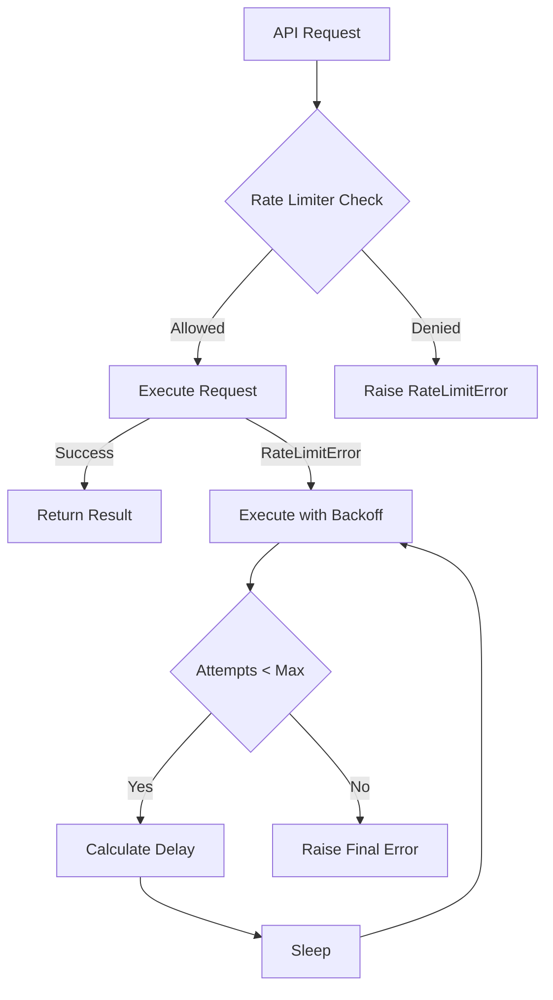

# Backoff Mechanisms Design Document

## Overview

The Bank Statement Separator implements a comprehensive backoff mechanism to handle API rate limiting gracefully. This system combines **exponential backoff with jitter** and **token bucket rate limiting** to ensure reliable operation while respecting API constraints.

## Architecture Components

### 1. Rate Limiter (`RateLimiter` class)

The rate limiter implements a **token bucket algorithm** with the following features:

- **Per-minute limits**: Tracks requests in a sliding window (removes timestamps older than 60 seconds)
- **Burst capacity**: Allows short-term request spikes using a token pool
- **Thread-safe**: Uses `threading.Lock()` for concurrent access protection
- **Statistics tracking**: Provides real-time usage metrics via `get_stats()` method
- **Token replenishment**: Simple time-based replenishment to prevent complete depletion

#### Token Bucket Implementation Details

```python
class RateLimiter:
    def __init__(self, config: RateLimitConfig):
        self.config = config
        self._lock = threading.Lock()
        self._request_times: list[float] = []  # Sliding window timestamps
        self._burst_tokens = config.burst_limit  # Current token pool

    def acquire(self) -> bool:
        """Acquire permission with dual checks: per-minute limit + burst tokens"""
        # Clean old requests (sliding window)
        # Check per-minute limit
        # Check burst token availability
        # Allow request and consume token
```

```python
@dataclass
class RateLimitConfig:
    requests_per_minute: int = 50      # Sliding window limit
    requests_per_hour: int = 1000      # Hourly limit (currently unused)
    burst_limit: int = 10              # Token pool size
    backoff_min: float = 1.0           # Minimum backoff delay
    backoff_max: float = 60.0          # Maximum backoff delay
    backoff_multiplier: float = 2.0    # Exponential multiplier
```

### 2. Backoff Strategy (`BackoffStrategy` class)

Implements **exponential backoff with jitter** for retry logic:

- **Exponential growth**: Delay = `base_delay * (2 ** attempt)`
- **Jitter implementation**: `random.uniform(0.1, 1.0)` multiplier to prevent thundering herd
- **Capped delays**: Hard limit of 60 seconds maximum delay
- **Selective retries**: Only retries on `openai.RateLimitError`, fails immediately on other exceptions
- **Thread-safe execution**: Uses `time.sleep()` for delays (blocking but simple)

#### Core Implementation Methods

```python
@staticmethod
def calculate_backoff_delay(attempt: int, base_delay: float = 1.0) -> float:
    """Calculate delay with exponential backoff and jitter."""
    delay = base_delay * (2 ** attempt)  # Exponential growth
    jitter = random.uniform(0.1, 1.0)    # Random jitter 10%-100%
    return min(delay * jitter, 60.0)     # Cap at 60 seconds

@staticmethod
def execute_with_backoff(func, max_attempts: int = 5, base_delay: float = 1.0, *args, **kwargs):
    """Execute function with automatic retries on rate limit errors."""
    for attempt in range(max_attempts):
        try:
            return func(*args, **kwargs)  # Execute the function
        except RateLimitError as e:
            if attempt < max_attempts - 1:  # More attempts available
                delay = calculate_backoff_delay(attempt, base_delay)
                logger.warning(f"Backing off for {delay:.1f}s")
                time.sleep(delay)
            else:
                raise  # Final attempt failed
        except Exception as e:
            raise  # Non-rate-limit errors fail immediately
```

## Exponential Backoff Algorithm

### Delay Calculation

```python
def calculate_backoff_delay(attempt: int, base_delay: float = 1.0) -> float:
    delay = base_delay * (2 ** attempt)
    jitter = random.uniform(0.1, 1.0)
    return min(delay * jitter, 60.0)
```

### Example Delay Progression

| Attempt | Base Delay | Exponential | With Jitter (range) | Capped Result |
| ------- | ---------- | ----------- | ------------------- | ------------- |
| 0       | 1.0s       | 1.0s        | 0.1s - 1.0s         | 0.1s - 1.0s   |
| 1       | 1.0s       | 2.0s        | 0.2s - 2.0s         | 0.2s - 2.0s   |
| 2       | 1.0s       | 4.0s        | 0.4s - 4.0s         | 0.4s - 4.0s   |
| 3       | 1.0s       | 8.0s        | 0.8s - 8.0s         | 0.8s - 8.0s   |
| 4       | 1.0s       | 16.0s       | 1.6s - 16.0s        | 1.6s - 16.0s  |
| 5       | 1.0s       | 32.0s       | 3.2s - 32.0s        | 3.2s - 32.0s  |

## Integration with OpenAI Provider

### Execution Flow



### Key Integration Points

1. **Pre-request rate limiting**: `rate_limiter.acquire()` called before each API request in `_execute_with_rate_limiting()`
2. **Post-rate-limit backoff**: `BackoffStrategy.execute_with_backoff()` wraps the actual LLM API calls (`self.llm.invoke()`)
3. **Dual error handling**: Distinguishes between `RateLimitError` (retry) and `APIError` (fail immediately)
4. **Provider-specific configuration**: Uses `max_retries` from provider config, `backoff_min` from rate limit config
5. **Comprehensive logging**: Warning logs for backoff attempts, error logs for final failures

#### Integration Code Example

```python
def _execute_with_rate_limiting(self, func, *args, **kwargs):
    """Execute API call with rate limiting and backoff."""
    try:
        # Step 1: Check rate limiter
        if not self.rate_limiter.acquire():
            raise LLMProviderError("Rate limit exceeded")

        # Step 2: Execute with backoff strategy
        return BackoffStrategy.execute_with_backoff(
            func,
            self.max_retries,           # From provider config
            self.rate_limit_config.backoff_min,  # Base delay
            *args, **kwargs
        )

    except RateLimitError as e:
        # Step 3: Handle rate limit errors
        raise LLMProviderError(f"Rate limit after {self.max_retries} retries")
    except APIError as e:
        # Step 4: Handle other API errors (no retry)
        raise LLMProviderError(f"OpenAI API error: {str(e)}")
```

## Configuration

### Environment Variables

| Variable                     | Default | Description                           |
| ---------------------------- | ------- | ------------------------------------- |
| `OPENAI_REQUESTS_PER_MINUTE` | 50      | Maximum requests per minute           |
| `OPENAI_REQUESTS_PER_HOUR`   | 1000    | Maximum requests per hour             |
| `OPENAI_BURST_LIMIT`         | 10      | Burst capacity for immediate requests |
| `OPENAI_BACKOFF_MIN`         | 1.0     | Minimum backoff delay (seconds)       |
| `OPENAI_BACKOFF_MAX`         | 60.0    | Maximum backoff delay (seconds)       |
| `OPENAI_BACKOFF_MULTIPLIER`  | 2.0     | Exponential backoff multiplier        |

### Provider Configuration

```python
provider = OpenAIProvider(
    api_key="your-key",
    max_retries=2,  # Number of retry attempts
    rate_limit_config=RateLimitConfig(
        requests_per_minute=25,
        burst_limit=5,
        backoff_min=2.0
    )
)
```

## Error Handling

### Rate Limit Errors

- **Detection**: Catches `openai.RateLimitError`
- **Retry Logic**: Only retries on rate limit errors
- **Non-retryable**: Other exceptions fail immediately
- **Final Failure**: Raises `LLMProviderError` after max attempts

### Logging

```python
# Warning on rate limit hit
logger.warning(f"Rate limit hit (attempt {attempt + 1}/{max_attempts}), backing off for {delay:.1f}s")

# Error on final failure
logger.error(f"Rate limit error persisted after {max_attempts} attempts")
```

## Testing Strategy

### Unit Tests

- **Backoff calculation**: Verifies delay ranges and jitter
- **Retry logic**: Tests successful retry after failures
- **Rate limiting**: Validates token bucket behavior
- **Integration**: End-to-end provider testing

### Test Examples

```python
def test_execute_with_backoff_rate_limit():
    """Test backoff with rate limit errors."""
    call_count = 0
    def mock_func():
        nonlocal call_count
        call_count += 1
        if call_count < 3:
            raise RateLimitError("Rate limit", response=Mock(status_code=429), body={})
        return "success"

    start_time = time.time()
    result = BackoffStrategy.execute_with_backoff(
        mock_func, max_attempts=5, base_delay=0.5
    )
    end_time = time.time()

    assert result == "success"
    assert call_count == 3
    # Verify backoff delay occurred
    assert end_time - start_time >= 0.5

def test_calculate_backoff_delay():
    """Test backoff delay calculation with jitter."""
    delays = [BackoffStrategy.calculate_backoff_delay(attempt=0) for _ in range(10)]
    # First attempt: base_delay * (2^0) * jitter = 1.0 * 1.0 * [0.1, 1.0] = [0.1, 1.0]
    assert all(0.1 <= d <= 1.0 for d in delays)

    delays = [BackoffStrategy.calculate_backoff_delay(attempt=2) for _ in range(10)]
    # Third attempt: 1.0 * (2^2) * [0.1, 1.0] = 4.0 * [0.1, 1.0] = [0.4, 4.0]
    assert all(0.4 <= d <= 4.0 for d in delays)

def test_rate_limiter_burst_limit():
    """Test burst limit functionality."""
    config = RateLimitConfig(requests_per_minute=10, burst_limit=3)
    limiter = RateLimiter(config)

    # Should allow burst requests
    for _ in range(3):
        assert limiter.acquire() is True

    # Should deny after burst limit
    assert limiter.acquire() is False
```

## Performance Considerations

### Memory Usage

- **Request tracking**: Stores timestamps in list (sliding window)
- **Thread safety**: Lock contention minimal with short critical sections
- **Cleanup**: Automatic removal of old timestamps

### CPU Overhead

- **Minimal computation**: Simple arithmetic for backoff calculation
- **Random jitter**: Uses Python's `random.uniform()` (fast)
- **Lock efficiency**: Fine-grained locking reduces contention

## Monitoring and Observability

### Metrics Available

```python
stats = rate_limiter.get_stats()
# {
#     "requests_last_minute": 45,
#     "limit_per_minute": 50,
#     "burst_tokens_remaining": 3,
#     "burst_limit": 10,
#     "total_requests_tracked": 150
# }
```

### Log Analysis

- **Rate limit warnings**: Track frequency of backoffs
- **Final failures**: Monitor persistent rate limit issues
- **Delay patterns**: Analyze backoff effectiveness

## Best Practices

### Configuration Tuning

1. **Start conservative**: Begin with lower limits and increase gradually
2. **Monitor usage**: Use statistics to understand actual patterns
3. **Adjust for API changes**: Update limits when OpenAI policies change
4. **Test thoroughly**: Validate behavior under various conditions

### Error Recovery

1. **Graceful degradation**: Fall back to pattern matching on persistent failures
2. **User feedback**: Inform users of temporary service issues
3. **Retry limits**: Prevent infinite loops with reasonable attempt caps
4. **Circuit breaker**: Consider implementing if rate limits persist

## Troubleshooting

### Common Issues and Solutions

#### High Rate Limit Frequency

**Symptoms**: Frequent backoff warnings in logs

```
WARNING - Rate limit hit (attempt 1/2), backing off for 1.2s
```

**Solutions**:

- Reduce `OPENAI_REQUESTS_PER_MINUTE` in environment variables
- Increase `OPENAI_BURST_LIMIT` to handle traffic spikes
- Implement request batching or queuing
- Check for concurrent processes hitting the same API key

#### Persistent Rate Limit Errors

**Symptoms**: All retry attempts exhausted

```
ERROR - Rate limit error persisted after 2 attempts
```

**Solutions**:

- Verify API key limits with OpenAI dashboard
- Implement fallback processing (`ENABLE_FALLBACK_PROCESSING=true`)
- Add circuit breaker pattern to temporarily disable API calls
- Check for API key sharing across multiple applications

#### Excessive Memory Usage

**Symptoms**: Growing memory consumption over time

**Solutions**:

- The rate limiter automatically cleans old timestamps (60-second window)
- Monitor `total_requests_tracked` in statistics
- Consider reducing `requests_per_minute` if tracking too many requests

#### Thundering Herd Problems

**Symptoms**: Multiple instances hitting rate limits simultaneously

**Solutions**:

- Stagger application startup times
- Use different API keys for different instances
- Implement randomized delays in addition to jitter
- Consider a distributed rate limiting solution

### Debug Commands

```bash
# Check current rate limiter statistics
python -c "
from src.bank_statement_separator.utils.rate_limiter import load_rate_limit_config_from_env
from src.bank_statement_separator.utils.rate_limiter import RateLimiter
config = load_rate_limit_config_from_env()
limiter = RateLimiter(config)
print(limiter.get_stats())
"

# Monitor backoff logs
tail -f logs/application.log | grep -i "backoff\|rate.limit"
```

### Configuration Validation

```python
# Validate configuration values
config = load_rate_limit_config_from_env()
assert config.requests_per_minute > 0
assert 0 < config.backoff_min <= config.backoff_max <= 300
assert config.burst_limit >= 1
```

## Future Enhancements

### Potential Improvements

1. **Adaptive backoff**: Adjust delays based on API response headers
2. **Queue management**: Buffer requests during high load periods
3. **Multi-tier limits**: Different limits for different operation types
4. **Analytics**: Detailed metrics for usage pattern analysis

## API Compatibility and Version Considerations

### OpenAI API Versions

The backoff mechanism is designed to work with:

- **OpenAI Python Client**: `openai>=1.0.0`
- **RateLimitError**: Standard exception from OpenAI client
- **APIError**: General API errors (non-retryable)

### Backward Compatibility

- **Environment Variables**: All existing environment variables are preserved
- **Configuration**: `RateLimitConfig` dataclass maintains backward compatibility
- **Provider Interface**: No breaking changes to `LLMProvider` interface

### Migration Notes

When upgrading OpenAI client versions:

1. Verify `RateLimitError` exception handling remains compatible
2. Test backoff behavior with new API version
3. Update rate limits based on new API quotas
4. Monitor for changes in error response formats

### Dependencies

```python
# Core dependencies for backoff mechanism
openai>=1.0.0        # For RateLimitError exception
langchain-openai>=0.1.0  # For ChatOpenAI integration
```

This backoff mechanism ensures reliable operation while respecting API constraints, providing a robust foundation for the LLM-based document processing pipeline.
