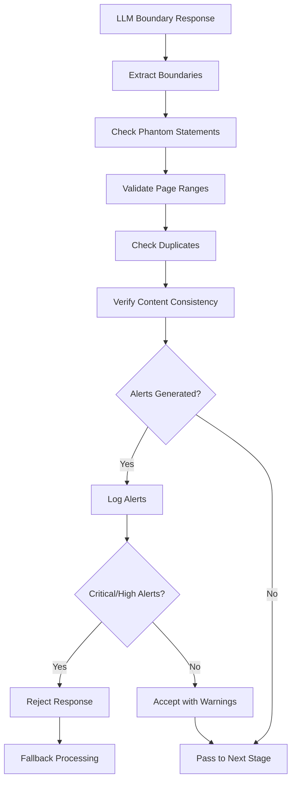
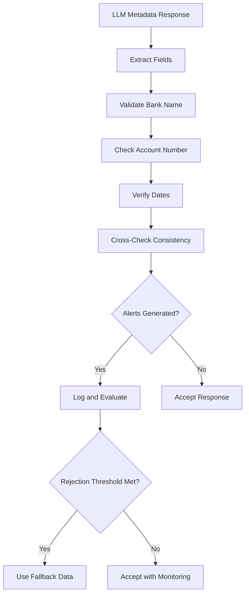

# Hallucination Detection System Design

## Overview

The Hallucination Detection System is a critical security and accuracy component of the bank statement separator that validates LLM responses to prevent processing of fabricated, incorrect, or potentially malicious data. Given the financial nature of the documents being processed, this system implements comprehensive validation rules to ensure data integrity and prevent the creation of incorrect or phantom bank statements.

## Table of Contents

1. [Architecture Overview](#architecture-overview)
2. [Hallucination Types](#hallucination-types)
3. [Detection Mechanisms](#detection-mechanisms)
4. [Severity Classification](#severity-classification)
5. [Validation Workflows](#validation-workflows)
6. [Response Rejection Logic](#response-rejection-logic)
7. [Integration Points](#integration-points)
8. [Implementation Details](#implementation-details)
9. [Configuration and Tuning](#configuration-and-tuning)
10. [Monitoring and Alerts](#monitoring-and-alerts)

## Architecture Overview

The hallucination detection system operates as a validation layer between LLM providers and the core processing workflow. It intercepts all LLM responses and applies rule-based validation before allowing data to proceed to file generation.

```
┌─────────────────┐    ┌──────────────────────┐    ┌─────────────────┐
│   LLM Provider  │───▶│ Hallucination        │───▶│  Core Workflow  │
│   (OpenAI/      │    │ Detection System     │    │  (PDF Gen)      │
│   Ollama)       │    │                      │    │                 │
└─────────────────┘    └──────────────────────┘    └─────────────────┘
                                │
                                ▼
                       ┌──────────────────────┐
                       │ Alerts & Logging     │
                       │ System               │
                       └──────────────────────┘
```

### Key Components

- **`HallucinationDetector`**: Core detection engine
- **`HallucinationType`**: Enumeration of detection categories
- **`HallucinationAlert`**: Data structure for detected issues
- **Provider Integration**: Embedded validation in LLM providers

## Hallucination Types

The system detects 8 distinct categories of hallucinations, each targeting specific failure modes of LLM processing:

### 1. Phantom Statements (`PHANTOM_STATEMENT`)

**Description**: Detection of more statement boundaries than physically possible in the document.

**Examples**:
- LLM reports 5 statements in a 3-page document
- Boundaries reference pages that don't exist (e.g., page 25 in a 12-page document)
- More statements detected than reasonable based on document structure

**Detection Logic**:
```python
if len(boundaries) > total_pages:
    # Critical: More statements than pages
    alert = HallucinationAlert(
        type=HallucinationType.PHANTOM_STATEMENT,
        severity="critical",
        description=f"Detected {len(boundaries)} statements in {total_pages}-page document"
    )
```

### 2. Invalid Page Ranges (`INVALID_PAGE_RANGE`)

**Description**: Logically impossible or invalid page number ranges in boundary detection.

**Examples**:
- start_page > end_page (e.g., pages 5-2)
- Negative page numbers (e.g., page -1)
- Pages exceeding document length

**Detection Logic**:
```python
if start_page > end_page:
    alert = HallucinationAlert(
        type=HallucinationType.INVALID_PAGE_RANGE,
        severity="high",
        description=f"Invalid range: start_page ({start_page}) > end_page ({end_page})"
    )
```

### 3. Impossible Dates (`IMPOSSIBLE_DATES`)

**Description**: Temporal inconsistencies in statement periods and dates.

**Examples**:
- Future dates (statements from 2035)
- Historically impossible dates (bank statements from 1850)
- Dates that exceed reasonable business ranges

**Detection Logic**:
```python
current_year = datetime.now().year
if year > current_year + 1:  # Allow 1 year buffer
    alert = HallucinationAlert(
        type=HallucinationType.IMPOSSIBLE_DATES,
        severity="high",
        description=f"Future year detected: {year}"
    )
elif year < 1950:  # Banks didn't issue modern statements before 1950
    alert = HallucinationAlert(
        type=HallucinationType.IMPOSSIBLE_DATES,
        severity="medium",
        description=f"Unrealistic historical year: {year}"
    )
```

### 4. Nonsensical Account Numbers (`NONSENSICAL_ACCOUNT`)

**Description**: Account numbers that follow obviously fake or impossible patterns.

**Examples**:
- Placeholder patterns: "123456789", "000000000"
- Masked patterns: "***1234***"
- Extremely long or short account numbers
- Non-numeric characters in inappropriate positions

**Detection Logic**:
```python
fake_patterns = ['123456789', '000000000', '111111111', '***1234***']
if account_number in fake_patterns:
    alert = HallucinationAlert(
        type=HallucinationType.NONSENSICAL_ACCOUNT,
        severity="high",
        description=f"Account number appears to be placeholder/fake"
    )

if len(account_number) > 20 or len(account_number) < 4:
    alert = HallucinationAlert(
        type=HallucinationType.NONSENSICAL_ACCOUNT,
        severity="medium",
        description=f"Account number has unusual length: {len(account_number)} chars"
    )
```

### 5. Fabricated Banks (`FABRICATED_BANK`)

**Description**: Bank names that don't exist in known banking institutions or don't appear in the document text.

**Examples**:
- "Fictional Credit Institution of Dreams"
- "Bank of Atlantis"
- Real bank names not found in the processed document text

**Detection Logic**:
```python
# Check if bank name appears in document
if bank_name not in document_text.lower():
    # Check against known bank list with substantial word matching
    substantial_words = [word for word in bank_name.split() 
                        if len(word) > 3 and word not in ['bank', 'banking', 'corporation']]
    
    found_match = any(word in substantial_words 
                     for known_bank in self.valid_banks 
                     for word in known_bank.split() if len(word) > 3)
    
    if not found_match:
        alert = HallucinationAlert(
            type=HallucinationType.FABRICATED_BANK,
            severity="high",
            description=f"Bank name not found in document and not in known bank list"
        )
```

### 6. Duplicate Boundaries (`DUPLICATE_BOUNDARIES`)

**Description**: Identical or overlapping statement boundaries that indicate processing errors.

**Examples**:
- Two statements with identical page ranges (1-5, 1-5)
- Overlapping boundaries that don't make logical sense

**Detection Logic**:
```python
seen_ranges = set()
for boundary in boundaries:
    range_key = (start_page, end_page)
    if range_key in seen_ranges:
        alert = HallucinationAlert(
            type=HallucinationType.DUPLICATE_BOUNDARIES,
            severity="medium",
            description=f"Duplicate boundary detected: pages {start_page}-{end_page}"
        )
```

### 7. Missing Content (`MISSING_CONTENT`)

**Description**: Boundaries detected in documents with insufficient textual content.

**Examples**:
- Multiple statements detected in a document with <50 characters
- Complex boundary structures in documents that are mostly blank

**Detection Logic**:
```python
if not document_text or len(document_text.strip()) < 50:
    for boundary in boundaries:
        alert = HallucinationAlert(
            type=HallucinationType.MISSING_CONTENT,
            severity="high",
            description=f"Boundary detected but document has minimal content"
        )
```

### 8. Inconsistent Data (`INCONSISTENT_DATA`)

**Description**: Internal contradictions within extracted metadata.

**Examples**:
- Credit union with direct Visa account type
- Checking account with credit card features
- Mismatched institution types and account characteristics

## Severity Classification

The system uses a four-tier severity system to prioritize responses:

### Critical Severity
- **Phantom Statements**: Immediate rejection, potential security risk
- **Threshold**: Any critical alert triggers rejection

### High Severity  
- **Invalid Page Ranges**: Data integrity issues
- **Fabricated Banks**: Accuracy concerns
- **Nonsensical Accounts**: Financial data reliability
- **Threshold**: 3 or more high alerts trigger rejection

### Medium Severity
- **Duplicate Boundaries**: Processing inefficiency
- **Historical Date Issues**: Minor temporal inconsistencies
- **Threshold**: Used for logging and monitoring, no automatic rejection

### Low Severity
- **Minor Inconsistencies**: Edge cases and ambiguous data
- **Threshold**: Monitoring only

## Detection Mechanisms

### 1. Rule-Based Validation

The primary detection mechanism uses deterministic rules based on business logic and data constraints:

```python
def _check_phantom_statements(self, boundaries, total_pages, document_text):
    alerts = []
    
    # Rule 1: Cannot have more statements than pages
    if len(boundaries) > total_pages:
        alerts.append(self._create_critical_alert("phantom_statement"))
    
    # Rule 2: Boundaries cannot exceed document length
    for boundary in boundaries:
        if boundary.get('start_page', 1) > total_pages:
            alerts.append(self._create_high_alert("phantom_statement"))
    
    return alerts
```

### 2. Pattern Matching

Suspicious patterns are identified using regular expressions and known problematic formats:

```python
suspicious_patterns = [
    r'bank\s+of\s+[a-z]+\s+[a-z]+\s+[a-z]+',  # Overly complex bank names
    r'account\s+ending\s+in\s+\*+',            # Generic descriptions
    r'statement\s+period\s+unknown'            # Placeholder text
]
```

### 3. Cross-Reference Validation

Bank names are validated against a curated list of known financial institutions:

```python
valid_banks = {
    'westpac', 'commonwealth', 'anz', 'nab', 'bendigo', 'suncorp',
    'chase', 'wells fargo', 'bank of america', 'citibank', 'jpmorgan',
    'hsbc', 'barclays', 'lloyds', 'royal bank', 'td bank'
}
```

### 4. Temporal Validation

Date validation ensures statements fall within reasonable business timeframes:

```python
def _check_impossible_dates(self, metadata):
    current_year = datetime.now().year
    years = re.findall(r'\b(1[89]\d{2}|20\d{2})\b', statement_period)
    
    for year in years:
        if int(year) > current_year + 1:
            # Future dates are highly suspicious
        elif int(year) < 1950:
            # Historical dates before modern banking
```

## Validation Workflows

### Boundary Validation Workflow



### Metadata Validation Workflow



## Response Rejection Logic

The system uses configurable thresholds to determine when to reject LLM responses:

```python
def should_reject_response(self, alerts: List[HallucinationAlert]) -> bool:
    critical_count = sum(1 for a in alerts if a.severity == "critical")
    high_count = sum(1 for a in alerts if a.severity == "high")
    
    # Rejection conditions:
    # 1. Any critical hallucination
    # 2. Three or more high-severity hallucinations
    return critical_count > 0 or high_count >= 3
```

### Rejection Actions

When rejection occurs:

1. **Log detailed rejection reason**
2. **Trigger fallback processing mechanism**
3. **Increment monitoring counters**
4. **Generate audit trail entry**

Example rejection scenario:
```python
if self.hallucination_detector.should_reject_response(alerts):
    logger.error("🚨 CRITICAL HALLUCINATION: Rejecting response due to severe hallucinations")
    raise LLMProviderError("Response rejected due to detected hallucinations - falling back to pattern matching")
```

## Integration Points

### LLM Provider Integration

Both OpenAI and Ollama providers integrate hallucination detection:

```python
# In OpenAIProvider.analyze_boundaries()
result = parser.parse(response.content)

# Validate for hallucinations
hallucination_alerts = self.hallucination_detector.validate_boundary_response(
    result.boundaries, total_pages, text
)

# Check rejection threshold
if self.hallucination_detector.should_reject_response(hallucination_alerts):
    raise LLMProviderError("Boundary analysis rejected due to detected hallucinations")
```

### Workflow Integration

The detection system integrates seamlessly with the LangGraph workflow:

```python
# In workflow nodes
try:
    llm_result = analyzer.detect_statement_boundaries(text_chunks, total_pages)
    # Process successful result
except LLMProviderError as e:
    logger.warning(f"LLM provider failed: {e}")
    # Automatic fallback to pattern matching
```

## Implementation Details

### Core Classes

#### HallucinationDetector

The main detection engine with the following key methods:

```python
class HallucinationDetector:
    def __init__(self):
        self.alerts = []
        self.valid_banks = {...}  # Known bank list
        self.suspicious_patterns = [...]  # Regex patterns
    
    def validate_boundary_response(self, boundaries, total_pages, document_text):
        """Primary boundary validation entry point"""
        
    def validate_metadata_response(self, metadata, document_text, page_range):
        """Primary metadata validation entry point"""
        
    def should_reject_response(self, alerts):
        """Determine if response should be rejected"""
        
    def log_hallucination_alerts(self, alerts, context):
        """Centralized logging for all alerts"""
```

#### HallucinationAlert

Data structure capturing alert details:

```python
@dataclass
class HallucinationAlert:
    type: HallucinationType
    severity: str  # "low", "medium", "high", "critical"
    description: str
    detected_value: Any
    expected_value: Any = None
    confidence: float = 1.0
    source: str = "unknown"
```

### Detection Methods

Each hallucination type has a dedicated detection method following consistent patterns:

```python
def _check_phantom_statements(self, boundaries, total_pages, document_text):
    """Template method for detection logic"""
    alerts = []
    
    # Apply specific validation rules
    if validation_condition:
        alerts.append(HallucinationAlert(
            type=HallucinationType.PHANTOM_STATEMENT,
            severity=self._determine_severity(condition),
            description=self._format_description(details),
            detected_value=actual_value,
            expected_value=expected_value,
            confidence=confidence_score,
            source="validation_source"
        ))
    
    return alerts
```

## Configuration and Tuning

### Configurable Parameters

The system supports configuration of key parameters:

```python
class HallucinationDetectorConfig:
    # Rejection thresholds
    CRITICAL_THRESHOLD = 0      # Any critical alert triggers rejection
    HIGH_SEVERITY_THRESHOLD = 3 # Number of high alerts for rejection
    
    # Date validation ranges
    MIN_STATEMENT_YEAR = 1950   # Earliest reasonable statement year
    MAX_FUTURE_YEARS = 1        # Buffer for future dates
    
    # Content validation
    MIN_CONTENT_LENGTH = 50     # Minimum document content for boundaries
    
    # Account number validation
    MIN_ACCOUNT_LENGTH = 4      # Minimum account number length
    MAX_ACCOUNT_LENGTH = 20     # Maximum account number length
```

### Bank List Management

The known bank list is expandable and maintainable:

```python
# Add new banks
detector.valid_banks.add('new_bank_name')

# Regional bank lists
US_BANKS = {'chase', 'wells fargo', 'bank of america', ...}
AU_BANKS = {'westpac', 'commonwealth', 'anz', 'nab', ...}
UK_BANKS = {'hsbc', 'barclays', 'lloyds', ...}
```

### Pattern Tuning

Suspicious patterns can be customized for different document types:

```python
# Westpac-specific patterns
WESTPAC_PATTERNS = [
    r'businesschoice',
    r'complete\s+access',
    r'page\s+1\s+of\s+\d+'
]

# Generic banking patterns  
GENERIC_PATTERNS = [
    r'statement\s+period',
    r'account\s+number',
    r'closing\s+balance'
]
```

## Monitoring and Alerts

### Logging Strategy

The system implements comprehensive logging at multiple levels:

```python
# Summary logging
logger.warning(f"🚨 HALLUCINATION DETECTION: {len(alerts)} alerts "
               f"(Critical: {critical_count}, High: {high_count})")

# Detailed logging for each alert
logger.error(f"🚨 {alert.severity.upper()} HALLUCINATION [{alert.type.value}]: "
             f"{alert.description} | Detected: {alert.detected_value}")

# Provider-specific logging
logger.error("🚨 CRITICAL HALLUCINATION: Rejecting OpenAI boundary response")
```

### Monitoring Metrics

Key metrics for system monitoring:

1. **Alert Rate**: Hallucinations detected per processing session
2. **Rejection Rate**: Percentage of LLM responses rejected
3. **Type Distribution**: Frequency of different hallucination types
4. **Provider Comparison**: Relative hallucination rates between OpenAI and Ollama
5. **False Positive Rate**: Legitimate responses incorrectly flagged

### Alert Summary

The system provides comprehensive summaries for monitoring dashboards:

```python
def get_hallucination_summary(self):
    return {
        "status": "hallucinations_detected" if self.alerts else "clean",
        "total_alerts": len(self.alerts),
        "by_severity": {
            "critical": count_by_severity["critical"],
            "high": count_by_severity["high"], 
            "medium": count_by_severity["medium"],
            "low": count_by_severity["low"]
        },
        "by_type": {
            "phantom_statement": count_by_type["phantom_statement"],
            "fabricated_bank": count_by_type["fabricated_bank"],
            # ... other types
        },
        "rejection_recommended": self.should_reject_response(self.alerts)
    }
```

## Security Considerations

### Data Protection

1. **No Sensitive Data in Logs**: Alert descriptions avoid logging full account numbers or personal information
2. **Sanitized Output**: Detected values are truncated or masked when logged
3. **Audit Trail**: All rejection decisions are logged with timestamps and reasons

### Attack Prevention

1. **Injection Prevention**: Pattern matching uses safe regex compilation
2. **Resource Limits**: Detection methods include timeout and complexity limits  
3. **Fail-Safe Design**: System defaults to rejection when in doubt

### Compliance

1. **Financial Data Integrity**: Ensures accuracy of financial document processing
2. **Audit Requirements**: Comprehensive logging supports compliance audits
3. **Error Transparency**: Clear reasoning for all rejection decisions

## Future Enhancements

### Machine Learning Integration

Potential areas for ML-based detection:

1. **Anomaly Detection**: Statistical models for unusual patterns
2. **Context-Aware Validation**: Document-specific validation rules
3. **Adaptive Thresholds**: Dynamic adjustment based on provider performance

### Advanced Pattern Recognition

1. **OCR Quality Assessment**: Validate against OCR confidence scores
2. **Document Structure Analysis**: Layout-based validation
3. **Cross-Document Validation**: Consistency across related statements

### Real-Time Monitoring

1. **Dashboard Integration**: Real-time alert visualization
2. **Performance Metrics**: Provider reliability scoring
3. **Predictive Alerts**: Early warning for provider degradation

## Conclusion

The Hallucination Detection System provides robust, multi-layered protection against LLM errors in financial document processing. By implementing comprehensive validation rules, clear severity classifications, and automatic fallback mechanisms, the system ensures data integrity while maintaining processing efficiency.

The modular design allows for easy extension and customization while the comprehensive logging and monitoring capabilities support operational excellence and continuous improvement.

This system is essential for maintaining trust and accuracy in automated financial document processing, particularly given the critical nature of banking information and the potential consequences of processing errors.