# CI/CD Setup and Workflows

This document describes the Continuous Integration and Continuous Deployment (CI/CD) setup for the Bank Statement Separator project.

## Overview

The CI/CD pipeline is built using GitHub Actions and consists of several workflows that automate testing, code quality checks, documentation deployment, and releases.

## Workflows

### Complete CI/CD Pipeline Overview

```mermaid
flowchart TD
    %% Developer Actions
    Dev[👨‍💻 Developer] --> Code[📝 Code Changes]
    Code --> Branch[🌿 Feature Branch]
    Branch --> PR[🔄 Pull Request]

    %% Pull Request Triggers
    PR --> CI_PR[🚀 CI Workflow<br/>PR Checks]
    PR --> DepReview[🔍 Dependency Review<br/>Security Scan]

    CI_PR --> TestMatrix[🧪 Test Matrix<br/>Python 3.11 & 3.12]
    TestMatrix --> UnitTests[⚡ Unit Tests]
    TestMatrix --> IntegrationTests[🔗 Integration Tests]
    TestMatrix --> SecurityScan[🛡️ Security Scan<br/>Safety & Bandit]

    DepReview --> VulnScan[🚨 Vulnerability Scan]
    DepReview --> LicenseCheck[📄 License Check]

    %% PR Approval and Merge
    UnitTests --> PRReview{📋 PR Review}
    IntegrationTests --> PRReview
    SecurityScan --> PRReview
    VulnScan --> PRReview
    LicenseCheck --> PRReview

    PRReview -->|✅ Approved| Merge[🎯 Merge to Main]
    PRReview -->|❌ Changes Needed| Code

    %% Main Branch Triggers
    Merge --> CI_Main[🚀 CI Workflow<br/>Main Branch]
    Merge --> ReleasePlease[🎁 Release Please<br/>Check Commits]
    Merge --> DocsTrigger{📚 Docs Changes?}

    CI_Main --> MainTests[🧪 Full Test Suite]
    CI_Main --> APITests[🌐 API Tests<br/>with OpenAI]
    MainTests --> TestSuccess{✅ Tests Pass?}
    APITests --> TestSuccess

    TestSuccess -->|❌ Failed| Notification[📧 Failure Notification]
    TestSuccess -->|✅ Passed| Success[✅ CI Success]

    %% Release Please Logic
    ReleasePlease --> ConventionalCheck{📝 Conventional<br/>Commits?}
    ConventionalCheck -->|❌ No| NoRelease[❌ No Release]
    ConventionalCheck -->|✅ Yes| ReleasePR[📋 Release PR Created]

    ReleasePR --> PRMerge{🔄 Release PR<br/>Merged?}
    PRMerge -->|❌ Not Yet| Wait[⏳ Wait for Merge]
    PRMerge -->|✅ Merged| CreateTag[🏷️ Create Git Tag]

    %% Release Workflow
    CreateTag --> ReleaseWorkflow[🚢 Release Workflow<br/>Tag Triggered]
    ReleaseWorkflow --> ReleaseBuild[🏗️ Build Package]
    ReleaseWorkflow --> ReleaseTest[🧪 Release Tests]

    ReleaseBuild --> BuildSuccess{✅ Build OK?}
    ReleaseTest --> BuildSuccess

    BuildSuccess -->|❌ Failed| BuildFail[❌ Release Failed]
    BuildSuccess -->|✅ Success| PyPIPublish[📦 Publish to PyPI]

    PyPIPublish --> GitHubRelease[📋 GitHub Release]
    GitHubRelease --> ReleaseSuccess[✅ Release Complete]

    %% Documentation Workflow
    DocsTrigger -->|✅ Yes| DocsWorkflow[📚 Docs Versioned<br/>Workflow]
    DocsTrigger -->|❌ No| Success

    DocsWorkflow --> DocsType{📋 Docs Type}
    DocsType -->|Latest| DeployLatest[🌐 Deploy Latest<br/>to GitHub Pages]
    DocsType -->|Version| DeployVersioned[🏷️ Deploy Versioned<br/>Documentation]

    DeployLatest --> DocsSuccess[✅ Docs Deployed]
    DeployVersioned --> DocsSuccess

    %% Styling
    classDef devStyle fill:#e3f2fd,stroke:#1565c0,stroke-width:2px
    classDef ciStyle fill:#e8f5e8,stroke:#2e7d32,stroke-width:2px
    classDef releaseStyle fill:#fff3e0,stroke:#ef6c00,stroke-width:2px
    classDef docsStyle fill:#f3e5f5,stroke:#7b1fa2,stroke-width:2px
    classDef errorStyle fill:#ffebee,stroke:#c62828,stroke-width:2px
    classDef successStyle fill:#e0f2f1,stroke:#00695c,stroke-width:2px

    class Dev,Code,Branch devStyle
    class CI_PR,CI_Main,TestMatrix,UnitTests,IntegrationTests,SecurityScan,MainTests,APITests ciStyle
    class ReleasePlease,ReleasePR,CreateTag,ReleaseWorkflow,ReleaseBuild,PyPIPublish,GitHubRelease releaseStyle
    class DocsWorkflow,DeployLatest,DeployVersioned docsStyle
    class BuildFail,Notification errorStyle
    class Success,ReleaseSuccess,DocsSuccess,TestSuccess successStyle
```



### 1. CI Workflow (`.github/workflows/ci.yml`)

**Triggers:**

- Push to `main` branch
- Pull requests to `main` or `develop` branches
- Manual workflow dispatch

**Jobs:**

- **test**: Runs comprehensive test suite across Python 3.11 and 3.12
- **test-with-api**: Runs API-dependent tests (requires OpenAI API key)
- **security**: Performs security scanning with Safety and Bandit

**Enhanced Features:**

- Matrix testing across multiple Python versions
- Code formatting and linting with Ruff
- Intelligent API test detection with environment validation
- Enhanced error reporting and debugging
- Comprehensive coverage reporting

### 2. Release Please Workflow (`.github/workflows/release-please.yml`)

**Triggers:**

- Push to `main` branch (with conventional commits)
- Automated based on commit message analysis

**Features:**

- Automated version bumping based on conventional commits
- Changelog generation from commit messages
- Release PR creation and management
- Git tag creation when release PR is merged
- Integration with release workflow

### 3. Release Workflow (`.github/workflows/release.yml`)

**Triggers:**

- Git tag push (created by release-please)
- Manual workflow dispatch with version input

**Enhanced Features:**

- Comprehensive debugging and logging
- Package building with uv
- Package verification with twine check
- PyPI publishing with enhanced error handling
- GitHub release creation with artifacts
- Simplified job conditions using startsWith() checks

### 4. Documentation Versioned Workflow (`.github/workflows/docs-versioned.yml`)

**Triggers:**

- Push to `main` branch (for latest docs)
- Release creation (for versioned docs)
- Repository dispatch events
- Manual workflow dispatch

**Recently Enhanced Features:**

- **Enhanced Trigger Logic**: Comprehensive event type handling for all deployment scenarios
- **Version Validation**: Semantic version format validation (X.Y.Z) before deployment
- **Safety Checks**: Explicit no-deployment warnings prevent workflow no-ops
- **Conflict Resolution**: Retry logic with exponential backoff for concurrent deployments
- **Mike Integration**: Uses Mike's built-in version selector (removed conflicting custom JS)
- **Comprehensive Logging**: Debug output for troubleshooting deployment issues
- **Robust Error Handling**: Automatic conflict resolution and retry mechanisms

**Key Improvements Made:**

- **Fixed Version Selector Bug**: Removed conflicting custom JavaScript that prevented version dropdown from working
- **Enhanced Workflow Logic**: Comprehensive trigger handling for push, release, dispatch, and manual events
- **Version Validation**: Prevents deployment of invalid version formats
- **Concurrency Control**: Exclusive concurrency group prevents gh-pages conflicts

### 5. Dependency Review (`.github/workflows/dependency-review.yml`)

**Triggers:**

- Pull requests to `main` or `develop` branches

**Features:**

- Automated dependency vulnerability scanning
- License compliance checking
- Security advisory integration
- Automated security updates

## Configuration Files

### Dependency Review Config (`.github/dependency-review-config.yml`)

```yaml
fail_on_severity: moderate
allow_licenses:
  - MIT
  - Apache-2.0
  - BSD-2-Clause
  - BSD-3-Clause
  - ISC
  - GPL-3.0-only
  - LGPL-3.0-only
fail_on_scopes:
  - runtime
vulnerability_check: true
license_check: true
```

!!! info "License Compatibility"
The project uses MIT License, which is fully compatible with the CI/CD pipeline's license checking. The dependency review workflow ensures all dependencies also use approved open-source licenses.

## Documentation Versioning

The CI/CD pipeline includes automated documentation versioning that deploys versioned documentation for each release:

### Versioned Deployment Process

1. **Latest Documentation**: Deployed to root (`/`) on every `main` branch push
2. **Versioned Documentation**: Deployed to `/v{major}.{minor}/` on each release
3. **Version Selector**: Automatically updated with available versions
4. **Cross-linking**: All versions include navigation to other versions

### URL Structure

```
https://madeinoz67.github.io/bank-statement-separator/
├── /                    # Latest documentation
├── /v2.2/              # Version 2.2 documentation
├── /v2.1/              # Version 2.1 documentation
└── /versions.json      # Version metadata
```

### Version Management

- **Automatic**: Versions are created automatically on GitHub releases
- **Manual**: Use workflow dispatch to deploy specific versions
- **Maintenance**: Old versions can be archived or removed as needed

### Version Selector

The documentation includes a version selector in the header that allows users to:

- Switch between documentation versions
- See all available versions
- Access version-specific content

**Recent Fix (Issue #18)**:
The version selector was previously showing only "latest" due to conflicting custom JavaScript implementation. This has been resolved by:

- Removing conflicting custom JavaScript (`docs/javascripts/version-selector.js`)
- Removing conflicting custom CSS (`docs/stylesheets/version-selector.css`)
- Activating Mike's built-in version selector with `extra.version.provider: mike`
- The version selector now properly displays all available versions (latest, v0.1.4, v0.2.0, etc.)

### Pull Request Template (`.github/PULL_REQUEST_TEMPLATE.md`)

Standardized PR template with:

- Change type classification
- Testing checklist
- Code review requirements

### Code Owners (`.github/CODEOWNERS`)

Automatic review assignment for:

- CI/CD changes
- Documentation updates
- Core application code
- Test modifications

## Repository Secrets

The following secrets need to be configured in GitHub repository settings:

- `OPENAI_API_KEY`: For API-dependent tests (with test environment detection)
- `PYPI_API_TOKEN`: For PyPI package publishing (enhanced error handling)
- `GOOGLE_ANALYTICS_KEY`: For documentation analytics (optional)

### Secret Management Best Practices

- **API Keys**: Use environment-specific test detection for OpenAI API key validation
- **PyPI Tokens**: Verify token permissions before publishing
- **Documentation**: Analytics keys are optional and won't block builds if missing

## Branch Protection Rules

Recommended branch protection rules for `main` branch:

1. **Require pull request reviews** before merging
2. **Require status checks** to pass:
   - `test (3.11)`
   - `test (3.12)`
   - `security`
   - `dependency-review`
3. **Require branches to be up to date** before merging
4. **Include administrators** in restrictions

## Local Development

### Prerequisites

- Python 3.11 or 3.12
- uv package manager
- Git

### Setup

```bash
# Install uv
curl -LsSf https://astral.sh/uv/install.sh | sh

# Clone repository
git clone https://github.com/madeinoz67/bank-statement-separator.git
cd bank-statement-separator

# Install dependencies
uv sync --group dev

# Run tests locally
uv run pytest

# Format code
uv run ruff format .

# Lint code
uv run ruff check .
```

### Pre-commit Checks

```bash
# Run all pre-commit checks
make pre-commit

# Or individually:
make format
make lint
make test-fast
```

## Testing Strategy

### Test Categories

- **Unit Tests**: Fast, isolated tests for individual functions
- **Integration Tests**: Tests for component interactions
- **API Tests**: Tests requiring external API access (OpenAI)
- **Edge Case Tests**: Tests for boundary conditions and error scenarios

### Test Execution

```bash
# Run all tests
make test

# Run unit tests only
make test-unit

# Run integration tests
make test-integration

# Run with coverage
make test-coverage
```

## Deployment

### Documentation

Documentation is automatically deployed to GitHub Pages on pushes to `main`:

- Build command: `uv run mkdocs build`
- Deploy command: `uv run mkdocs gh-deploy`

### Releases

#### Automated Release Process (Recommended)

1. **Make changes** using conventional commit messages:
   ```bash
   git commit -m "feat: add new statement detection algorithm"
   git commit -m "fix: resolve API key validation in test environments"
   git commit -m "docs: update workflow diagrams"
   ```
2. **Push to main** branch:
   ```bash
   git push origin main
   ```
3. **Release Please** will automatically:
   - Analyze commit messages
   - Create release PR with version bump
   - Generate changelog
4. **Merge release PR** to trigger:
   - Tag creation
   - Package build and PyPI publish
   - GitHub release creation
   - Documentation versioning

#### Manual Release Process (Legacy)

1. Update version in `pyproject.toml`
2. Create a git tag: `git tag v1.0.0`
3. Push the tag: `git push origin v1.0.0`
4. GitHub Actions will automatically handle the rest

#### Release Workflow Features

- **Enhanced Debugging**: Comprehensive logging for troubleshooting
- **Package Verification**: Validation with twine before publishing
- **Error Recovery**: Detailed error reporting and recovery suggestions
- **Conditional Logic**: Smart workflow triggering based on event types

## Monitoring and Maintenance

### Workflow Monitoring

- Check GitHub Actions tab for workflow status
- Review failed jobs for error details
- Monitor coverage trends on Codecov

### Dependency Updates

- Dependencies are managed via `uv`
- Security updates are scanned automatically
- Use `uv lock --upgrade` to update dependencies

### Performance Monitoring

- Test execution times are tracked
- Coverage reports show code coverage trends
- Security scans identify vulnerabilities

## Troubleshooting

### Common Issues

1. **Test Failures**
   - Check Python version compatibility
   - Verify dependencies are installed
   - Review test output for specific errors

2. **CI Pipeline Failures**
   - Check GitHub Actions logs
   - Verify secrets are configured
   - Ensure branch protection rules aren't blocking merges

3. **Documentation Deployment Issues**
   - Verify MkDocs configuration
   - Check GitHub Pages settings
   - Review build logs for errors

### Getting Help

- Check existing issues on GitHub
- Review workflow logs in GitHub Actions
- Consult the project's documentation
- Contact maintainers for support

## CLI Features

### Header Suppression

The CLI includes a `--no-header` option to suppress the application banner display:

```bash
# Process file without header
uv run python -m src.bank_statement_separator.main process input.pdf --no-header

# Batch process without header
uv run python -m src.bank_statement_separator.main batch-process /path/to/pdfs --no-header

# Version command (no header option needed as it has its own display)
uv run python -m src.bank_statement_separator.main version
```

This is useful for:

- **Scripting**: Clean output for automated scripts
- **Integration**: Better integration with other tools
- **CI/CD**: Reduced noise in automated pipelines
- **API Usage**: Cleaner output for programmatic usage

## Future Enhancements

Potential improvements to the CI/CD pipeline:

- Docker container builds and testing
- Performance regression testing
- Automated dependency updates (Dependabot)
- Multi-platform testing (Windows, macOS)
- Integration with external services
- Advanced security scanning
- Automated changelog generation
