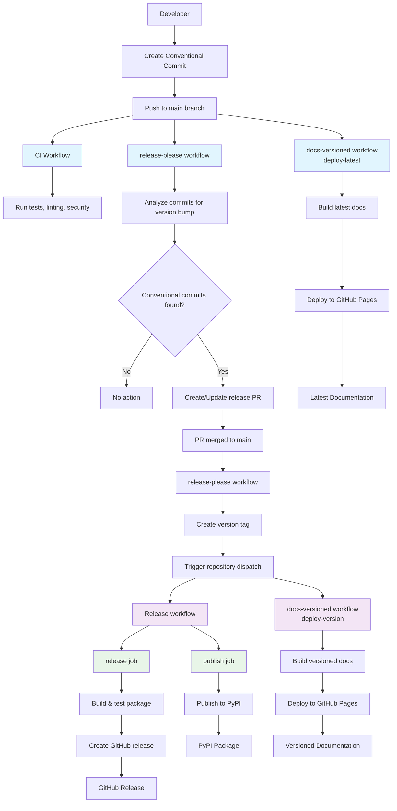

# Release Management

This guide covers the release management processes for the Bank Statement Separator project, including both automated and manual release workflows.

## Overview

The project supports two release management approaches:

1. **Automated Releases** (Recommended) - Using release-please with conventional commits
2. **Manual Releases** (Alternative) - For special cases requiring direct control

## Complete Workflow Architecture



### Workflow Components

#### 🔄 CI Workflow (`ci.yml`)
- **Trigger**: Push to main/develop branches, PRs
- **Purpose**: Continuous integration and quality checks
- **Actions**:
  - Run unit and integration tests
  - Code formatting and linting (Ruff)
  - Security scanning (Bandit)
  - Coverage reporting

#### 🔄 Release-Please Workflow (`release-please.yml`)
- **Trigger**: Push to main branch
- **Purpose**: Automated semantic versioning
- **Actions**:
  - Analyze conventional commits
  - Determine version bumps (major/minor/patch)
  - Create/update release PRs with changelogs
  - Create version tags on PR merge
  - Trigger downstream workflows via repository dispatch

#### 🚀 Release Workflow (`release.yml`)
- **Trigger**: Tag push or repository dispatch
- **Purpose**: Package building and publishing
- **Jobs**:
  - **release**: Build, test, create GitHub release
  - **publish**: Publish to PyPI

#### 📚 Docs-Versioned Workflow (`docs-versioned.yml`)
- **Trigger**: Push to main, releases, repository dispatch
- **Purpose**: Documentation deployment and versioning
- **Jobs**:
  - **deploy-latest**: Deploy latest docs on main push
  - **deploy-version**: Deploy versioned docs on releases
  - **update-version-selector**: Update version dropdown

#### 🔗 Workflow Integration
- **Repository Dispatch**: Reliable cross-workflow communication
- **Job Dependencies**: Proper sequencing of build/test/deploy
- **Conditional Execution**: Smart triggering based on event types
- **Parallel Processing**: Independent jobs run concurrently where possible

## Automated Release Process

### How It Works

The automated release process uses [release-please](https://github.com/googleapis/release-please) to manage versioning and releases based on conventional commit messages.

#### Workflow Steps

1. **Developer commits** with conventional format:
   ```bash
   git commit -m "feat: add new PDF processing feature"
   git push origin main
   ```

2. **Release-please analyzes commits** and determines version bump:
   - `feat:` commits → Minor version (1.0.0 → 1.1.0)
   - `fix:` commits → Patch version (1.0.0 → 1.0.1)
   - `BREAKING CHANGE:` → Major version (1.0.0 → 2.0.0)

3. **Release PR created** with:
   - Updated `pyproject.toml` version
   - Generated changelog
   - Release notes

4. **When PR merged**:
   - Tag created automatically (`v1.1.0`)
   - Release workflow triggered
   - Package built and published

### Configuration Files

#### release-please-config.json
```json
{
  "packages": {
    ".": {
      "package-name": "bank-statement-separator",
      "changelog-path": "docs/release_notes/CHANGELOG.md",
      "release-type": "python",
      "tag-format": "v${version}",
      "extra-files": ["pyproject.toml"]
    }
  }
}
```

#### .release-please-manifest.json
```json
{
  ".": "1.0.0"
}
```

### Conventional Commit Format

All commits must follow the conventional commit format:

```
<type>[optional scope]: <description>

[optional body]

[optional footer(s)]
```

#### Types
- `feat`: New feature
- `fix`: Bug fix
- `docs`: Documentation changes
- `style`: Code style changes
- `refactor`: Code refactoring
- `test`: Testing changes
- `chore`: Maintenance changes

#### Examples
```bash
git commit -m "feat: add PDF boundary detection"
git commit -m "fix: resolve account number extraction bug"
git commit -m "docs: update installation guide"
```

## Manual Release Process

### When to Use Manual Releases

Manual releases are appropriate for:
- Urgent security fixes
- Special versioning requirements
- Testing workflow changes
- One-off releases with specific needs

### Step-by-Step Manual Release

#### 1. Update Version
```bash
# Edit pyproject.toml
version = "2.0.2"

# Commit the change
git add pyproject.toml
git commit -m "chore: update version to 2.0.2"
git push origin main
```

#### 2. Create Release Tag
```bash
# Create annotated tag
git tag -a v2.0.2 -m "Release v2.0.2

## Changes
- Enhanced PyPI metadata
- Fixed build configuration

## Breaking Changes
- None"

# Push tag
git push origin v2.0.2
```

#### 3. Trigger Release Workflow
1. Go to GitHub → Actions tab
2. Select "Release" workflow
3. Click "Run workflow"
4. Enter tag: `v2.0.2`
5. Click "Run workflow"

#### 4. Monitor and Verify
- Check workflow progress in Actions tab
- Verify GitHub release creation
- Confirm PyPI package upload
- Test versioned documentation

## Release Workflow Details

### Jobs and Responsibilities

#### Release Job
- Runs tests and builds package
- Creates GitHub release with assets
- Generates release notes

#### Publish Job
- Publishes package to PyPI
- Requires `PYPI_API_TOKEN` secret
- Only runs on tag pushes or manual triggers

#### Docs-Version Job
- Builds versioned documentation
- Deploys to GitHub Pages subdirectory
- Updates version selector

### Workflow Triggers

#### Automatic Triggers
```yaml
on:
  push:
    tags:
      - "v*"
```

#### Manual Triggers
```yaml
on:
  workflow_dispatch:
    inputs:
      tag:
        description: "Tag to release"
        required: true
        type: string
```

## Version Management

### Semantic Versioning

The project follows [Semantic Versioning](https://semver.org/):

- **MAJOR**: Breaking changes
- **MINOR**: New features (backward compatible)
- **PATCH**: Bug fixes (backward compatible)

### Version File Updates

Release-please automatically updates:
- `pyproject.toml` version field
- `.release-please-manifest.json` version tracking
- Creates versioned changelog

### Manual Version Updates

For manual releases, update:
- `pyproject.toml` version field
- Ensure version matches tag name

## Quality Assurance

### Pre-Release Checks

#### Automated Checks
- Unit tests pass
- Integration tests pass
- Code formatting validated
- Security scans pass

#### Manual Checks
- Test package installation
- Verify documentation builds
- Check release notes accuracy

### Post-Release Verification

#### GitHub Release
- ✅ Correct tag and version
- ✅ Release notes generated
- ✅ Assets attached (.whl, .tar.gz)

#### PyPI Package
- ✅ Package uploaded successfully
- ✅ Metadata displays correctly
- ✅ Installation works

#### Documentation
- ✅ Versioned docs deployed
- ✅ Navigation functional
- ✅ Links work correctly

## Troubleshooting

### Common Issues

#### "File already exists" on PyPI
- **Cause**: Version already exists on PyPI
- **Solution**: Increment version number

#### Workflow doesn't trigger
- **Cause**: Tag format doesn't match pattern
- **Solution**: Ensure tag follows `v*` format

#### Build failures
- **Cause**: pyproject.toml syntax errors
- **Solution**: Validate TOML syntax

#### PyPI upload failures
- **Cause**: Missing or invalid API token
- **Solution**: Check repository secrets

### Debug Commands

```bash
# Validate pyproject.toml
python -c "import tomllib; tomllib.load(open('pyproject.toml', 'rb'))"

# Test package build
uv build

# Check package contents
uv run twine check dist/*

# Test installation
pip install --dry-run bank-statement-separator==2.0.2
```

## Best Practices

### Commit Message Guidelines

1. **Use conventional format** for all commits
2. **Write clear descriptions** of changes
3. **Reference issues** when applicable
4. **Keep commits focused** on single changes

### Release Planning

1. **Plan release content** in advance
2. **Test changes thoroughly** before release
3. **Update documentation** as needed
4. **Communicate changes** to stakeholders

### Version Strategy

1. **Use semantic versioning** consistently
2. **Plan breaking changes** carefully
3. **Document deprecations** in advance
4. **Maintain backward compatibility** when possible

## Migration Guide

### From Manual to Automated Releases

1. **Adopt conventional commits** in development workflow
2. **Test automated process** with feature branches
3. **Gradually reduce manual releases**
4. **Monitor automated releases** for quality

### Repository Setup

Required secrets:
- `PYPI_API_TOKEN`: For PyPI publishing
- `OPENAI_API_KEY`: For CI testing (optional)

Required permissions:
- Contents: write (for releases)
- Pull requests: write (for release-please)

## Support

For release management issues:
1. Check this documentation
2. Review GitHub Actions logs
3. Create issue in repository
4. Contact development team

## Quick Reference

### Automated Release
```bash
git commit -m "feat: add new feature"
git push origin main
# Release-please handles the rest
```

### Manual Release
```bash
# Update version
vim pyproject.toml

# Create tag
git tag -a v2.0.2 -m "Release v2.0.2"

# Push and trigger
git push origin v2.0.2
# Then use GitHub Actions UI
```

### Check Status
```bash
# Check tags
git tag -l

# Check releases
gh release list

# Check PyPI
pip index versions bank-statement-separator
