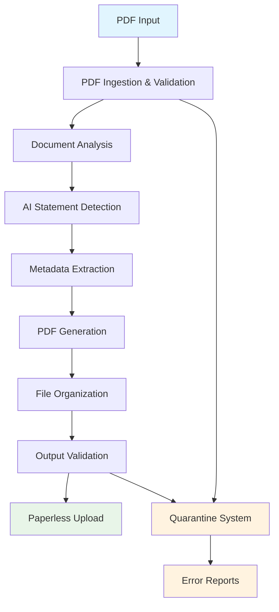

# Bank Statement Separator

An AI-powered tool for automatically separating multi-statement PDF files using LangChain and LangGraph.

<!-- Force deployment refresh: 2025-09-08 -->


## Overview

The Bank Statement Separator is designed for people who need to process single PDF files containing multiple bank statements. It uses advanced AI models to intelligently identify statement boundaries, extract metadata, and create separate PDF files for each statement.

!!! tip "Production Ready"
This system is production-ready with comprehensive error handling, document management integration, and robust testing. All 37 unit tests are passing with full feature coverage.

## Key Features

- **AI-Powered Analysis**: Uses OpenAI GPT models for intelligent boundary detection
- **LangGraph Workflow**: Stateful 8-node processing pipeline with error recovery
- **Smart Metadata Extraction**: Automatically extracts account numbers, statement periods, and bank names
- **Batch Processing**: Process multiple PDF files from directories with pattern filtering
- **Paperless-ngx Integration**: Automatic upload to paperless-ngx document management with auto-creation
- **Comprehensive Error Handling**: Advanced quarantine system with detailed error reports and recovery suggestions
- **Document Validation**: Pre-processing validation with configurable strictness levels
- **Security-First Design**: Secure credential management and file access controls
- **Rich CLI Interface**: Beautiful multi-command interface with progress indicators and quarantine management
- **Audit Logging**: Complete processing trail for compliance requirements

## Advanced Error Handling and Resilience

The system implements sophisticated error handling with automatic recovery mechanisms to ensure reliable operation:

### Intelligent Backoff Mechanisms

- **Exponential Backoff with Jitter**: Automatically retries failed API requests with exponentially increasing delays (1s, 2s, 4s, 8s...) plus random jitter (10%-100%) to prevent thundering herd problems
- **Rate Limiting Integration**: Token bucket algorithm with sliding window tracking prevents API quota exhaustion
- **Selective Retry Logic**: Only retries on recoverable errors (RateLimitError, timeouts) while failing immediately on permanent issues
- **Configurable Limits**: Adjustable retry attempts (default: 3) and delay caps (max: 60 seconds)

### Comprehensive Quarantine System

- **Automatic Document Isolation**: Failed documents are moved to quarantine with detailed error reports
- **Recovery Suggestions**: Actionable guidance provided for each error type (password removal, format repair, quota upgrades)
- **Validation Strictness Levels**: Configurable error handling from strict (high accuracy) to lenient (high success rate)
- **Error Report Generation**: JSON reports with timestamps, failure reasons, and system diagnostics

### Resilience Features

- **Fallback Processing**: Pattern-based boundary detection when AI services are unavailable
- **Circuit Breaker Pattern**: Temporary service suspension during persistent failures
- **Resource Management**: Memory and disk monitoring with graceful degradation
- **Audit Trail**: Complete error history for compliance and troubleshooting

For detailed implementation details, see the [Backoff Mechanisms Design Document](design/backoff_mechanisms.md) and [Error Handling Guide](user-guide/error-handling.md).

## Architecture Overview



!!! info "Detailed Architecture"
For comprehensive workflow diagrams including error handling flows, retry logic, and configuration impacts, see the complete [Workflow Architecture Overview](architecture/workflow-overview.md).

## Use Cases

### Financial Analysis

- **Multi-Bank Processing**: Handle statements from multiple banks in a single document
- **Period Separation**: Automatically separate statements by time periods
- **Compliance Reporting**: Maintain audit trails for regulatory requirements

### Document Management

- **Paperless Integration**: Auto-upload to document management systems
- **Metadata Extraction**: Automatically tag and categorize documents
- **Error Recovery**: Smart handling of processing failures with recovery suggestions

### Cybersecurity

- **Secure Processing**: Protected credential management and access controls
- **Audit Logging**: Complete activity trails for security compliance
- **Input Validation**: Comprehensive document validation before processing

## Quick Start

Get started in just a few minutes:

=== "Installation"

    ```bash
    # Clone the repository
    git clone <repository-url>
    cd bank-statement-separator

    # Install dependencies
    uv sync
    ```

=== "Configuration"

    ```bash
    # Copy configuration template
    cp .env.example .env

    # Edit with your settings
    nano .env
    ```

=== "First Run"

    ```bash
    # Test with dry-run
    uv run bank-statement-separator \
      process statements.pdf --dry-run --yes

    # Process single document
    uv run bank-statement-separator \
      process statements.pdf -o ./output --yes

    # Process batch of documents
    uv run bank-statement-separator \
      batch-process /path/to/pdfs -o ./batch-output --yes
    ```

## System Requirements

- **Python**: 3.11 or higher
- **Package Manager**: [UV](https://docs.astral.sh/uv/) (recommended)
- **API Access**: OpenAI API key for optimal processing
- **Memory**: 4GB RAM minimum (8GB+ recommended for large documents)
- **Storage**: 100MB+ for quarantine and log files

## Performance Metrics

| Metric               | Value                      |
| -------------------- | -------------------------- |
| **Processing Speed** | ~2-5 seconds per statement |
| **Accuracy Rate**    | 95%+ with AI analysis      |
| **Fallback Success** | 85%+ without API key       |
| **Memory Usage**     | <500MB per document        |
| **Test Coverage**    | 37/37 unit tests passing   |

## Roadmap

### ✅ Phase 1 - Core Features (Complete)

- [x] LangGraph workflow implementation
- [x] AI-powered boundary detection
- [x] Metadata extraction
- [x] CLI interface

### ✅ Phase 2 - Enhanced Features (Complete)

- [x] Error handling & quarantine system
- [x] Paperless-ngx integration
- [x] Multi-command CLI
- [x] Document validation
- [x] Comprehensive testing

### 🚧 Phase 3 - Production Deployment (In Progress)

- [ ] Docker containerization
- [ ] Cloud storage integration
- [ ] Web dashboard
- [ ] Batch processing

### 📋 Phase 4 - Enterprise Features (Planned)

- [ ] Multi-tenant support
- [ ] REST API
- [ ] Custom workflows
- [ ] Advanced analytics

## Documentation Versions

This documentation is versioned to match software releases. Use the version selector in the top navigation to access documentation for specific versions:

- **Latest**: Always points to the most recent release documentation
- **Versioned**: Access documentation for specific releases

!!! info "Version URLs" - Latest: `https://madeinoz67.github.io/bank-statement-separator/` - Version 0.1.0: `https://madeinoz67.github.io/bank-statement-separator/v0.1.0/`

!!! tip "Finding Your Version"
Check your installed version with: `uv run bank-statement-separator --version`

## License

This project is licensed under the MIT License - see the [LICENSE](https://github.com/madeinoz67/bank-statement-separator/blob/main/LICENSE) file for details.

The MIT License is a permissive open-source license that allows you to:

- ✅ Use the software for commercial and private purposes
- ✅ Modify and distribute the software
- ✅ Include in proprietary software
- ✅ Sublicense the software

## Get Help

- **Documentation**: Browse the complete [documentation](getting-started/)
- **Issues**: Report bugs or request features on [GitHub Issues](https://github.com/madeinoz67/bank-statement-separator/issues)
- **Discussions**: Join the community discussion
- **Support**: Contact the development team

## What's New

!!! success "Latest Release: [Version 0.1.4](release_notes/RELEASE_NOTES_v0.1.4.md)" - **Release Workflow Enhancement**: Comprehensive debugging and improved PyPI publishing automation - **Advanced Error Diagnostics**: Detailed workflow context output for troubleshooting release issues - **Package Verification**: Enhanced validation with twine check before PyPI upload - **Simplified Job Conditions**: Clear workflow trigger logic using startsWith() checks - **Production-Ready Automation**: Complete release infrastructure for future automated releases - **Backward Compatibility**: No breaking changes, seamless upgrade from previous versions

    See full [Release Notes](release_notes/RELEASE_NOTES_v0.1.4.md) for detailed changes and [Changelog](release_notes/CHANGELOG.md) for complete version history.

---

Ready to get started? Check out the [Quick Start Guide](getting-started/quick-start.md) or dive into the [Installation Instructions](getting-started/installation.md).
