# Fragment Detection and Quality Control

The Workflow Bank Statement Separator includes advanced fragment detection capabilities to ensure high-quality document separation by automatically identifying and filtering out incomplete or low-quality document sections.

## What Are Fragments?

Fragments are incomplete document sections that may appear in multi-statement PDF files, such as:

- **Single transaction records** without full statement context
- **Test footers or headers** without actual content
- **Incomplete pages** with minimal banking information
- **Orphaned content** between proper statements

## Fragment Detection Features

### Automatic Detection

The system automatically identifies fragments using multiple criteria:

#### Content Analysis

- **Text Length**: Very short text sections (< 200 characters)
- **Missing Elements**: Lack of critical statement components
- **Pattern Matching**: Recognition of fragment-specific patterns

#### Critical Element Validation

For each section, the system checks for:

- **Bank Name**: Major bank identifiers (Westpac, ANZ, NAB, etc.)
- **Account Information**: Account numbers, BSB codes, account types
- **Period Information**: Statement dates, period ranges

#### Confidence Scoring

- **High Confidence (> 0.7)**: Complete statements with all elements
- **Medium Confidence (0.3-0.7)**: Acceptable statements with some missing info
- **Low Confidence (< 0.3)**: Fragments automatically filtered out

## How Fragment Filtering Works

### Detection Process

```mermaid
flowchart TD
    A[Document Section] --> B{Text Length > 200?}
    B -->|No| F[Fragment Detected]
    B -->|Yes| C{Pattern Matching}
    C -->|Fragment Patterns| F
    C -->|Valid Patterns| D{Critical Elements}
    D -->|< 2 Elements| F
    D -->|≥ 2 Elements| E[Valid Statement]

    F --> G[Confidence = 0.2]
    E --> H[Calculate Confidence]

    G --> I{Confidence < 0.3?}
    H --> I
    I -->|Yes| J[Skip in PDF Generation]
    I -->|No| K[Include in Output]

    classDef fragmentStyle fill:#ffebee,stroke:#c62828,stroke-width:2px
    classDef validStyle fill:#e8f5e8,stroke:#2e7d32,stroke-width:2px
    classDef decisionStyle fill:#f3e5f5,stroke:#7b1fa2,stroke-width:2px

    class F,G,J fragmentStyle
    class E,K validStyle
    class B,C,D,I decisionStyle
```



### Filtering Logic

The system applies the following filtering rules:

1. **Pre-Processing**: Analyze each detected statement boundary
2. **Confidence Assessment**: Calculate confidence based on multiple factors
3. **Quality Gate**: Skip sections with confidence < 0.3
4. **Validation Adjustment**: Account for skipped pages in validation

## Fragment Pattern Examples

### Common Fragment Patterns

=== "Transaction Fragment"
`     10/02/2023 ATM WITHDRAWAL Livingston-Miller -$32.00 $25,397.00
    This statement was generated for testing purposes on 31/08/2025
    `
**Detection**: Single transaction without statement context

=== "Test Footer"
`     This statement was generated for testing purposes on 31/08/2025
    `
**Detection**: Test text without banking content

=== "Page Number Only"
`     Page 3
    `
**Detection**: Minimal content, no banking information

### Valid Statement Headers

=== "Complete Header"
`     NAB Banking Corporation
    Statement Period: 16 January 2023 to 15 February 2023
    Account Type: Classic Banking Account
    Account Number: 084234560267
    BSB: 084-419
    `
**Detection**: Full statement header with all elements

## Configuration Options

### Confidence Threshold

You can adjust the fragment filtering threshold through environment variables:

```bash
# Default: 0.3 (30%)
FRAGMENT_CONFIDENCE_THRESHOLD=0.3

# More aggressive filtering (fewer fragments allowed)
FRAGMENT_CONFIDENCE_THRESHOLD=0.5

# Less aggressive filtering (more fragments allowed)
FRAGMENT_CONFIDENCE_THRESHOLD=0.1
```

### Fragment Detection Sensitivity

```bash
# Enable/disable fragment detection
ENABLE_FRAGMENT_DETECTION=true

# Minimum text length for valid statements
MIN_STATEMENT_TEXT_LENGTH=200

# Required critical elements count
MIN_CRITICAL_ELEMENTS=2
```

## Logging and Monitoring

### Fragment Detection Logs

The system logs detailed information about fragment detection:

```
2025-08-31 19:42:12 - WARNING - Detected fragment page at 4-6
2025-08-31 19:42:12 - WARNING - Skipping fragment with confidence 0.2: pages 4-6 (3 pages)
```

### Processing Summary

The output includes fragment information:

```
📊 PDF generation complete: created 1 files, skipped 1 fragments (3 pages)
```

### Validation Reporting

Validation accounts for skipped fragments:

```
✅ Page count matches: 3 pages (skipped 3 fragment pages)
```

## Best Practices

### When Using Fragment Detection

1. **Monitor Logs**: Review fragment detection logs to ensure valid content isn't being filtered
2. **Adjust Thresholds**: Fine-tune confidence thresholds for your document types
3. **Validate Results**: Check that important content isn't incorrectly classified as fragments

### Troubleshooting

#### Valid Content Being Filtered

If valid statements are being classified as fragments:

1. **Check Patterns**: Ensure your statements contain standard banking headers
2. **Lower Threshold**: Reduce the confidence threshold temporarily
3. **Review Logs**: Check what elements are missing from filtered content

#### Fragments Not Being Filtered

If fragments are still appearing in output:

1. **Increase Threshold**: Raise the confidence threshold
2. **Add Patterns**: Contribute additional fragment patterns
3. **Manual Review**: Use dry-run mode to preview detection results

## API Integration

### Confidence Scoring

When using the API, confidence scores are available in results:

```json
{
  "statements": [
    {
      "pages": "1-3",
      "confidence": 0.85,
      "status": "included"
    },
    {
      "pages": "4-6",
      "confidence": 0.15,
      "status": "filtered_fragment"
    }
  ]
}
```

### Fragment Reporting

Detailed fragment information is available:

```json
{
  "processing_summary": {
    "total_sections": 2,
    "valid_statements": 1,
    "filtered_fragments": 1,
    "skipped_pages": 3
  }
}
```

## Impact on Accuracy

Fragment detection significantly improves output quality:

- **Reduced Noise**: Eliminates incomplete document sections
- **Cleaner Separation**: Prevents mixing of fragments with valid statements
- **Better Metadata**: Focuses extraction on complete statements only
- **Improved Validation**: Accounts for intentionally skipped content

The fragment detection feature ensures that only high-quality, complete bank statements are included in the final output, improving the overall reliability and usability of the separated documents.
