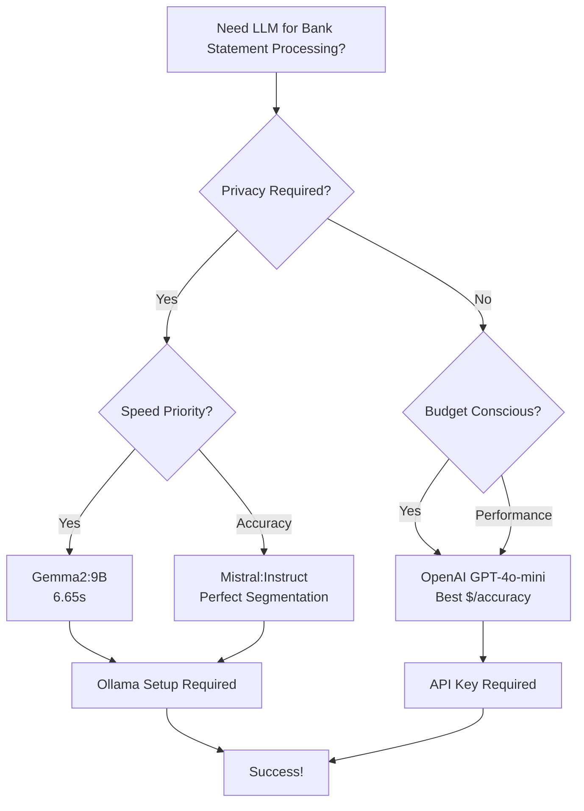

# Model Selection Guide

## Quick Start - Just Tell Me What To Use!

### Best Overall Choice
**Recommendation: OpenAI GPT-4o-mini**
```bash
# Set in your .env file
LLM_PROVIDER=openai
OPENAI_MODEL=gpt-4o-mini
OPENAI_API_KEY=your-api-key-here
```
**Why**: Perfect accuracy, fast processing (10.85s), complete metadata extraction.

### Best Local/Offline Choice
**Recommendation: Gemma2:9B**
```bash
# Set in your .env file
LLM_PROVIDER=ollama
OLLAMA_MODEL=gemma2:9b
OLLAMA_BASE_URL=http://localhost:11434
```
**Why**: Fastest local model (6.65s), excellent quality, privacy-first.

### Most Cost-Effective
**Recommendation: Self-hosted Gemma2:9B**
- Zero marginal cost after setup
- Excellent performance for unlimited processing
- Full privacy and control

## Decision Tree



## Detailed Selection Criteria

### 1. Accuracy Requirements

#### Maximum Accuracy Needed
- **Primary**: OpenAI GPT-4o-mini
- **Backup**: Mistral:Instruct (local)
- **Use Case**: Financial institutions, legal compliance, audit requirements

#### Good Accuracy Acceptable  
- **Primary**: Gemma2:9B
- **Backup**: Qwen2.5-Coder
- **Use Case**: Personal finance, small business, development

#### Basic Processing OK
- **Primary**: Pattern Fallback (no LLM)
- **Backup**: Any functional Ollama model
- **Use Case**: Bulk processing, non-critical applications

### 2. Speed Requirements

#### Ultra-Fast (< 8 seconds)
1. **Gemma2:9B** - 6.65s ⚡
2. **Mistral:Instruct** - 7.63s

#### Fast (8-12 seconds)  
1. **Qwen2.5:latest** - 8.53s
2. **Qwen2.5-Coder** - 8.59s
3. **OpenHermes** - 8.66s
4. **OpenAI GPT-4o-mini** - 10.85s

#### Moderate (12-20 seconds)
- Acceptable for batch processing
- DeepSeek-r1:latest, Phi4:latest

#### Slow (> 20 seconds)
- Only for background processing
- Avoid: Qwen3, Llama3.2

### 3. Privacy & Deployment

#### Privacy-First (Local Only)
1. **Gemma2:9B** - Best local performance
2. **Mistral:Instruct** - Open source, reliable
3. **Qwen2.5-Coder** - Feature complete

#### Cloud OK (Best Performance)  
1. **OpenAI GPT-4o-mini** - Industry leading
2. **Gemma2:9B** - Local backup option
3. **Mistral:Instruct** - Local alternative

#### Hybrid (Flexible)
- Primary: OpenAI for critical documents  
- Fallback: Gemma2:9B for routine processing
- Configure both in environment

### 4. Technical Resources

#### Limited Resources (< 8GB RAM)
- **OpenAI GPT-4o-mini** (cloud)
- **Mistral:Instruct** (4.1GB model)
- **OpenHermes** (4.1GB model)

#### Moderate Resources (8-12GB RAM)
- **Gemma2:9B** (5.4GB model) ✅ Recommended
- **Qwen2.5 variants** (4.7GB each)
- Multiple models can be loaded

#### High Resources (12GB+ RAM)
- **All models available**
- **DeepSeek-Coder-v2** (8.9GB) for development
- **Phi4** (9.1GB) for Microsoft ecosystem

### 5. Rate Limiting & Backoff Considerations

#### API-Based Models (OpenAI)
- **Rate Limiting**: 50 requests/minute, 1000/hour default limits
- **Backoff Strategy**: Automatic exponential backoff with jitter on rate limits
- **Burst Capacity**: 10 immediate requests allowed
- **Best For**: High-volume processing with built-in reliability

#### Local Models (Ollama)
- **Rate Limiting**: None (limited by local hardware)
- **Backoff Strategy**: Minimal (only for temporary resource issues)
- **Burst Capacity**: Limited by available RAM/CPU
- **Best For**: Consistent processing without API delays

#### Rate Limiting Configuration
```bash
# OpenAI rate limiting (default values)
OPENAI_REQUESTS_PER_MINUTE=50
OPENAI_BURST_LIMIT=10
OPENAI_BACKOFF_MIN=1.0
OPENAI_BACKOFF_MAX=60.0

# For high-volume processing, increase limits
OPENAI_REQUESTS_PER_MINUTE=100
OPENAI_BURST_LIMIT=20
```

## Configuration Examples

### Production Setup (High Accuracy)
```bash
# Primary provider
LLM_PROVIDER=openai
OPENAI_API_KEY=your-key
OPENAI_MODEL=gpt-4o-mini

# Fallback enabled
LLM_FALLBACK_ENABLED=true
OLLAMA_MODEL=gemma2:9b
OLLAMA_BASE_URL=http://localhost:11434
```

### Development Setup (Speed Focus)
```bash  
# Fast local processing
LLM_PROVIDER=ollama
OLLAMA_MODEL=gemma2:9b
OLLAMA_BASE_URL=http://localhost:11434

# No fallback for consistent testing
LLM_FALLBACK_ENABLED=false
```

### Privacy Setup (Local Only)
```bash
# Local only - no cloud services
LLM_PROVIDER=ollama
OLLAMA_MODEL=gemma2:9b
OLLAMA_BASE_URL=http://localhost:11434

# Pattern fallback only
ENABLE_FALLBACK_PROCESSING=true
LLM_FALLBACK_ENABLED=false
```

### Budget Setup (Minimize Costs)
```bash
# Free local processing
LLM_PROVIDER=ollama  
OLLAMA_MODEL=mistral:instruct
OLLAMA_BASE_URL=http://localhost:11434

# OpenAI for critical documents only
# (comment out to disable)
# OPENAI_API_KEY=your-key
```

## Use Case Specific Recommendations

### Personal Finance Management
- **Model**: Gemma2:9B
- **Reason**: Fast, accurate, zero ongoing cost
- **Setup**: Local Ollama installation

### Small Business Accounting  
- **Model**: OpenAI GPT-4o-mini
- **Reason**: Maximum accuracy for tax compliance
- **Setup**: Cloud API with local backup

### Enterprise/Financial Institution
- **Model**: OpenAI GPT-4o-mini + Gemma2:9B hybrid
- **Reason**: Accuracy for compliance, local for privacy
- **Setup**: Dual provider configuration

### Software Development  
- **Model**: Qwen2.5-Coder
- **Reason**: Optimized for structured document processing
- **Setup**: Local Ollama with development flags

### Research/Academic
- **Model**: Multiple models for comparison
- **Reason**: Study model behavior and accuracy  
- **Setup**: Full Ollama installation with all models

## Common Issues & Solutions

### "Model is too slow"
1. ✅ Switch to Gemma2:9B (fastest)
2. ✅ Check GPU availability for Ollama
3. ✅ Increase Ollama memory allocation
4. ⚠️ Consider OpenAI for speed + accuracy

### "Accuracy is poor"  
1. ✅ Switch to OpenAI GPT-4o-mini
2. ✅ Try Mistral:Instruct for better segmentation
3. ✅ Check document quality (scanned vs native PDF)
4. ⚠️ Enable fallback processing as backup

### "Model keeps failing"
1. ✅ Check Ollama server status: `ollama list`
2. ✅ Restart Ollama: `ollama serve`
3. ✅ Switch to different model temporarily
4. ✅ Enable fallback processing

### "High memory usage"
1. ✅ Use smaller models (Mistral, OpenHermes)
2. ✅ Switch to OpenAI (cloud processing)
3. ✅ Process fewer documents simultaneously
4. ✅ Restart Ollama between large batches

### "Inconsistent results"
1. ✅ Set LLM_TEMPERATURE=0 for deterministic output
2. ✅ Use OpenAI for maximum consistency
3. ✅ Enable validation strictness: VALIDATION_STRICTNESS=strict
4. ✅ Check document format consistency

## Performance Monitoring

### Key Metrics to Track
- **Processing Time**: Target < 15 seconds per document
- **Accuracy Rate**: Track segmentation errors
- **Memory Usage**: Monitor during processing  
- **Error Rate**: LLM failures vs fallback usage

### Monitoring Commands
```bash
# Check Ollama status
ollama ps

# Monitor memory usage
htop # or Activity Monitor on Mac

# Check processing logs
tail -f logs/statement_processing.log

# Test model performance
uv run python -m src.bank_statement_separator.main process test.pdf --dry-run
```

## Getting Help

### Model-Specific Issues
- **OpenAI**: Check API key, quota limits, model availability
- **Ollama**: Verify installation, model downloads, memory allocation
- **Pattern Fallback**: Review document format, enable debug logging

### Performance Issues
1. Run model comparison tests (see [LLM Model Testing](../reference/llm_model_testing.md))
2. Check [Model Comparison Tables](../reference/model_comparison_tables.md) 
3. Review [Troubleshooting Guide](../reference/troubleshooting.md)

### Community Resources
- GitHub Issues: Report bugs and feature requests
- Discussions: Model performance comparisons
- Documentation: Detailed technical references
